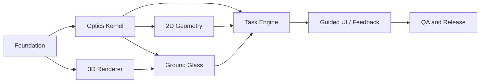

# View Camera Movement Simulator — Task Inventory

**版本**：MVP v0.1
**估算單位**：S / M / L
**優先級**：P0 = MVP 必須；P1 = MVP 完成前建議；P2 = MVP 後
**依賴關係**：以 Task ID 表示

---

## 1. 工作流與總覽



| 工作包                        | Task 數量 | 主要成果                         |
| -------------------------- | ------: | ---------------------------- |
| Foundation                 |       6 | 可運行前端骨架與型別基線                 |
| Optics Kernel              |       9 | 可測試的 movement、焦平面、景深計算       |
| 3D Rendering               |       6 | 相機模型、場景及 movement 視覺化        |
| Ground Glass               |       6 | 倒像預覽、景深與輔助圖層                 |
| Geometry Diagram           |       5 | 側視及俯視幾何圖                     |
| Scene Content              |       5 | 三個可用教學場景                     |
| Task Engine                |       6 | 關卡、判定、回饋                     |
| Application UI             |       7 | Guided / Free Mode、控制與 reset |
| QA / Performance / Release |       9 | 測試、可及性、部署                    |
| **合計**                     |  **59** | MVP 可交付版本                    |

---

# 2. Foundation

## FND-001 — 初始化前端專案

**優先級**：P0
**估算**：S
**依賴**：無

### 工作內容

* 建立 React、TypeScript、Vite 專案。
* 設定 ESLint、Prettier。
* 建立基本 npm scripts：

  * `dev`
  * `build`
  * `test`
  * `test:watch`
  * `test:e2e`
  * `lint`
  * `typecheck`

### 驗收條件

* `npm run dev` 可啟動。
* `npm run build` 成功。
* `npm run typecheck` 無錯誤。
* `npm run lint` 無 error。

---

## FND-002 — 建立專案目錄與模組邊界

**優先級**：P0
**估算**：S
**依賴**：FND-001

### 工作內容

建立 Spec 指定的主要目錄：

```text
src/
  app/
  components/
  core/
  scenes/
  render/
  state/
  types/
  utils/
  tests/
```

### 驗收條件

* `core/optics` 不可 import React。
* `render` 不可包含任務規則。
* `components` 不可自行重算光學幾何。
* `types` 為共用型別唯一來源。

---

## FND-003 — 安裝核心依賴

**優先級**：P0
**估算**：S
**依賴**：FND-001

### 工作內容

安裝並設定：

* `three`
* `@react-three/fiber`
* `@react-three/drei`
* `zustand`
* `vitest`
* `@testing-library/react`
* `playwright`
* SVG 或數學工具所需依賴

### 驗收條件

* 可 render 最小化 React Three Fiber Canvas。
* Vitest 可執行最小測試。
* Playwright 可開啟本地測試頁。

---

## FND-004 — 建立共用型別與常數

**優先級**：P0
**估算**：M
**依賴**：FND-002

### 工作內容

建立：

* `Vec3`
* `Ray`
* `Plane`
* `Transform`
* `Bounds3`
* `CameraState`
* `DerivedOpticsState`
* `SceneDefinition`
* `TaskDefinition`
* `TaskEvaluation`
* `CAMERA_CONSTANTS`

### 驗收條件

* 不可使用 `any` 作核心光學型別。
* 4×5 底片尺寸固定為 `127mm × 101.6mm`。
* 150mm 鏡頭、rise / tilt / swing 範圍符合 Spec。

---

## FND-005 — 建立應用路由與 App Shell

**優先級**：P0
**估算**：M
**依賴**：FND-001

### 工作內容

建立頁面：

* 首頁。
* 模式選擇頁。
* Simulator Workspace。
* 關卡結果頁或結果 overlay。

### 驗收條件

* 使用者可從首頁進入 Guided Mode。
* 使用者可從首頁進入 Free Mode。
* URL 可包含 scene 或 task 識別碼。
* 無效 route 有 fallback。

---

## FND-006 — 建立錯誤與 WebGL fallback 畫面

**優先級**：P1
**估算**：S
**依賴**：FND-005

### 工作內容

* 偵測 WebGL 可用性。
* 3D 資產載入失敗時顯示 error state。
* optics calculation failure 時採安全回退。

### 驗收條件

* WebGL 不可用時不會白畫面。
* 顯示可理解的瀏覽器支援提示。
* 無法載入資產時可重新嘗試。

---

# 3. State Management

## STA-001 — 建立 Zustand App Store

**優先級**：P0
**估算**：M
**依賴**：FND-004

### 工作內容

建立：

* camera state。
* active scene。
* active task。
* UI display options。
* current task evaluation。
* reset actions。

### 驗收條件

提供以下 actions：

```ts
setRise()
setTilt()
setSwing()
setFocusDistance()
setAperture()
setMode()
setActiveScene()
setActiveTask()
resetMovements()
restartTask()
```

---

## STA-002 — Movement 輸入限制與正規化

**優先級**：P0
**估算**：S
**依賴**：STA-001

### 工作內容

* Rise clamp 至 `0–40mm`。
* Tilt clamp 至 `-10° 至 +10°`。
* Swing clamp 至 `-10° 至 +10°`。
* Aperture 僅容許固定選項。
* Focus 範圍依 scene 定義限制。

### 驗收條件

* 任何 UI 或程式呼叫均不能寫入非法 movement。
* 單元測試覆蓋所有 clamp 情況。

---

## STA-003 — Derived Optics State Selector

**優先級**：P0
**估算**：M
**依賴**：STA-001、OPT-001

### 工作內容

* 由 `CameraState + SceneDefinition` 產生 `DerivedOpticsState`。
* 使用 memoization 避免不必要重算。
* 所有 renderer 及 task evaluator 使用同一 selector。

### 驗收條件

* UI component 不可自行呼叫零散 optics helpers。
* 同一 camera state 只產生一份共享 derived state。
* movement 改變時衍生狀態可於 100ms 內更新。

---

# 4. Optics Kernel

## OPT-001 — 向量、平面及射線數學工具

**優先級**：P0
**估算**：M
**依賴**：FND-004

### 工作內容

實作：

* 向量加減、dot、cross、normalize。
* Ray-plane intersection。
* Plane-plane intersection line。
* angle between normals。
* rotation matrix / quaternion helpers。
* 世界座標及毫米單位處理。

### 驗收條件

* 所有函式為 pure functions。
* 零向量與平行平面有安全處理。
* 單元測試涵蓋正常及 edge cases。

---

## OPT-002 — 計算底片平面與鏡頭平面

**優先級**：P0
**估算**：M
**依賴**：OPT-001、STA-002

### 工作內容

* 固定 film plane。
* 根據 rise 計算 lens center。
* 根據 tilt / swing 計算 lens normal。
* 產生 `lensPlane`。

### 驗收條件

* Rise 只改變 lens center 的 Y 值。
* Tilt 繞 X 軸。
* Swing 繞 Y 軸。
* zero movement 時 lens normal 與 film normal 平行。

---

## OPT-003 — 光軸與 Focus Point 計算

**優先級**：P0
**估算**：S
**依賴**：OPT-002

### 工作內容

* 計算 optical axis ray。
* 根據 focus distance 建立 focus point。
* 支援各 scene 自訂 focus 最小／最大距離。

### 驗收條件

* focus point 位於 optical axis 上。
* 改變 focus distance 時 focus point 沿光軸移動。
* Rise、tilt、swing 改變時光軸方向可正確更新。

---

## OPT-004 — 平行平面焦平面模型

**優先級**：P0
**估算**：S
**依賴**：OPT-003

### 工作內容

當 lens plane 與 film plane 夾角低於 `0.1°`：

* focus plane 與 film plane 平行。
* focus plane 通過 focus point。

### 驗收條件

* tilt = 0 且 swing = 0 時必定進入此模式。
* 不可出現 NaN、Infinity 或零向量 normal。
* 單元測試驗證 focus plane 平行 film plane。

---

## OPT-005 — Scheimpflug 焦平面計算

**優先級**：P0
**估算**：L
**依賴**：OPT-001、OPT-003、OPT-004

### 工作內容

* 計算 lens plane 與 film plane 交線。
* 建立通過交線與 focus point 的 focus plane。
* 回傳正常化 focus plane normal。
* 產生側視及俯視使用的交線資訊。

### 驗收條件

* Tilt 改變時，focus plane 側視方向有明確變化。
* Swing 改變時，focus plane 俯視方向有明確變化。
* Aperture 不可改變 focus plane normal。
* 接近平行情況正確回退至 OPT-004。

---

## OPT-006 — 景深近似平面計算

**優先級**：P0
**估算**：M
**依賴**：OPT-005

### 工作內容

* 根據 aperture 產生 focus plane 前後可接受清晰範圍。
* 產生 near plane、far plane。
* 建立可配置的 tolerance 常數。

### 驗收條件

* f/5.6 的景深最窄。
* f/32 的景深最寬。
* aperture 改變不改變最佳焦平面方向。
* 近端與遠端平面不應互相反轉。

---

## OPT-007 — Focus Target Sharpness 計算

**優先級**：P0
**估算**：M
**依賴**：OPT-006

### 工作內容

* 計算 target 到 focus plane 距離。
* 計算 sharpness score。
* 映射為：

  * `sharp`
  * `near-sharp`
  * `blurred`

### 驗收條件

* score 範圍為 `0–1`。
* 位於 focus plane 上的 target score 接近 `1`。
* 距離增加時 score 單調遞減。
* aperture 收細時 acceptable range 變大。

---

## OPT-008 — Ground Glass Off-axis Projection 計算

**優先級**：P0
**估算**：L
**依賴**：OPT-002、OPT-003

### 工作內容

* 根據 lens center、film plane 四角、焦距建立 off-axis projection。
* 輸出 renderer 可用的 projection data 或 camera matrix。
* Rise 必須影響取景垂直位置。

### 驗收條件

* Rise 增加時，ground glass 可見更多場景上方內容。
* 不可將 Rise 以整部相機 tilt 偽造。
* projection 對 zero rise 正常工作。

---

## OPT-009 — Optics Kernel 整合函式

**優先級**：P0
**估算**：M
**依賴**：OPT-002 至 OPT-008

### 工作內容

實作：

```ts
deriveOpticsState(
  camera: CameraState,
  scene: SceneDefinition
): DerivedOpticsState
```

### 驗收條件

* 單一函式回傳所有 renderer 及 evaluator 所需資料。
* 不可由 UI 層自行重算 optics。
* unit tests 覆蓋 rise、tilt、swing、focus、aperture 組合。

---

# 5. 3D Rendering

## REN-001 — 建立主 WebGL Canvas 與渲染基礎

**優先級**：P0
**估算**：M
**依賴**：FND-003、STA-001

### 工作內容

* 建立 React Three Fiber Canvas。
* 設定燈光、背景、resize。
* 建立 loading state。
* 支援 reduced motion。

### 驗收條件

* Canvas 可在 1280px 寬桌面畫面正常顯示。
* 視窗 resize 不破版。
* WebGL 載入失敗時交由 FND-006 fallback。

---

## REN-002 — 建立抽象化 4×5 View Camera 模型

**優先級**：P0
**估算**：M
**依賴**：REN-001、OPT-002

### 工作內容

建立簡化模型：

* 前組。
* 後組。
* 鏡頭板。
* 鏡頭。
* 皮腔。
* 底片平面。
* 光軸。
* 基本 rail。

### 驗收條件

* Rise、tilt、swing 在 3D 模型上可明確看見。
* 後組固定。
* 相機模型不需高寫實度，但須具結構可讀性。

---

## REN-003 — 前組 Movement 視覺同步

**優先級**：P0
**估算**：M
**依賴**：REN-002、OPT-009

### 工作內容

* Lens board 跟隨 `lensCenterWorld`。
* Lens board rotation 跟隨 `lensNormalWorld`。
* Bellows 視覺上連接前組與後組。
* 顯示可選的 lens plane overlay。

### 驗收條件

* Rise 不改變鏡頭板角度。
* Tilt / swing 不改變 rise 數值。
* 3D movement 與 2D diagram 一致。

---

## REN-004 — 場景鏡頭與操作視角

**優先級**：P1
**估算**：M
**依賴**：REN-001

### 工作內容

* 使用者可旋轉、縮放 3D 相機外觀視角。
* 不可移動虛擬大片幅相機在場景中的拍攝位置。
* 提供 reset 3D view。

### 驗收條件

* 使用者不會意外改變拍攝相機本身位置。
* 操作視角 reset 後回到預設角度。
* 不影響 ground glass 或 optics state。

---

## REN-005 — Focus Plane 與景深區域 3D Overlay

**優先級**：P1
**估算**：M
**依賴**：OPT-009、REN-001

### 工作內容

* 在 3D 場景顯示 focus plane。
* 可選顯示 depth-of-field near / far 範圍。
* 提供開關。

### 驗收條件

* Tilt / swing 時 overlay 平面同步轉動。
* Aperture 改變時只有景深範圍改變。
* Overlay 可關閉，不遮擋主要學習內容。

---

## REN-006 — 3D Renderer 效能調校

**優先級**：P1
**估算**：M
**依賴**：REN-001 至 REN-005

### 工作內容

* 限制 geometry complexity。
* 實作 asset lazy loading。
* 避免每 frame 建立新 object。
* 為低效能裝置建立 render quality 等級。

### 驗收條件

* 常見 desktop 保持至少 30 FPS。
* 連續拖拉 slider 不會出現嚴重卡頓。
* 3D scene 切換目標少於 2 秒。

---

# 6. Ground Glass

## GGL-001 — 建立 Ground Glass Render Target

**優先級**：P0
**估算**：L
**依賴**：REN-001、OPT-008

### 工作內容

* 建立專用 off-axis camera。
* 建立 color render target。
* 將 render target 顯示於 UI panel。
* 4×5 aspect ratio。

### 驗收條件

* Ground glass 顯示與主 3D 場景不同的「拍攝視角」。
* Rise、tilt、swing、focus 改變時更新。
* 4×5 邊界固定正確。

---

## GGL-002 — 地面玻璃倒像與方向輔助

**優先級**：P0
**估算**：S
**依賴**：GGL-001

### 工作內容

* 預設 flip X、flip Y。
* orientation assist 開啟時畫面轉正。
* UI 顯示模式狀態。

### 驗收條件

* 關閉 assist 時，上下及左右均反轉。
* 開啟 assist 時，畫面正常方向。
* 切換不影響 optics calculation。

---

## GGL-003 — Grid 與數值 Overlay

**優先級**：P0
**估算**：S
**依賴**：GGL-001、STA-001

### 工作內容

* 三分格或九宮格。
* 中心線。
* 顯示 rise、tilt、swing、focus、aperture。
* 格線可開關。

### 驗收條件

* Overlay 不改變 render target 本身。
* 數值與 state 同步。
* 格線於 orientation assist 切換時仍正確顯示。

---

## GGL-004 — 教學級 DOF Shader

**優先級**：P0
**估算**：L
**依賴**：GGL-001、OPT-006、OPT-007

### 工作內容

* 建立 depth render target。
* 由 pixel depth 重建或近似 world position。
* 根據 focus plane 距離與 aperture 計算 blur strength。
* 套用半解析度 blur pass。

### 驗收條件

* 改變 aperture 時模糊範圍有可見差異。
* tilt / swing 時清晰帶方向隨 focus plane 改變。
* f/5.6 明顯比 f/32 景深窄。
* 低效能模式可降低 quality。

---

## GGL-005 — Focus Assist Overlay

**優先級**：P1
**估算**：M
**依賴**：OPT-007、GGL-004

### 工作內容

* 顯示 key targets 的清晰度狀態。
* 使用文字、pattern、outline 或 icon。
* 顯示 `sharp / near-sharp / blurred`。

### 驗收條件

* 不只依賴單一顏色。
* 可關閉。
* 顯示的 target score 與 task evaluator 相同。

---

## GGL-006 — Ground Glass 放大檢視

**優先級**：P1
**估算**：M
**依賴**：GGL-001

### 工作內容

* 使用者可點擊局部放大。
* 提供拖曳或固定 focus target 放大。
* 可離開放大模式。

### 驗收條件

* 放大不改變相機 state。
* 影像清晰度變化仍可辨識。
* 不能造成主畫面顯著掉幀。

---

# 7. 2D Geometry Diagram

## GEO-001 — SVG Geometry 基礎元件

**優先級**：P0
**估算**：M
**依賴**：FND-004、OPT-009

### 工作內容

建立可重用 SVG 元件：

* PlaneLine。
* RayLine。
* FocusPointMarker。
* DOFRegion。
* AxisLabel。
* DiagramLegend。

### 驗收條件

* 所有項目有文字標示。
* 不只透過顏色辨識。
* 可依不同 scene scale 自動縮放。

---

## GEO-002 — 側視圖：Rise / Tilt / Focus

**優先級**：P0
**估算**：M
**依賴**：GEO-001

### 工作內容

顯示：

* film plane。
* lens plane。
* optical axis。
* focus point。
* focus plane。
* near / far DOF plane。
* rise displacement。
* 桌面或建築代表物件。

### 驗收條件

* Rise 改變 lens center 高度。
* Tilt 改變 focus plane 側視方向。
* Aperture 只改變 DOF 範圍。
* 所有圖形取自 `DerivedOpticsState`。

---

## GEO-003 — 俯視圖：Swing / Focus

**優先級**：P0
**估算**：M
**依賴**：GEO-001

### 工作內容

顯示：

* film plane。
* lens plane。
* optical axis。
* focus plane。
* DOF 範圍。
* 斜向主體代表線。

### 驗收條件

* Swing 改變 lens plane 與 focus plane 俯視方向。
* Tilt 不應錯誤改變俯視 focus plane 主方向。
* UI 可切換側視與俯視。

---

## GEO-004 — Diagram View Selector 與圖例

**優先級**：P1
**估算**：S
**依賴**：GEO-002、GEO-003

### 工作內容

* 側視／俯視切換。
* 依關卡預設適當視圖。
* 顯示圖例與簡短說明。

### 驗收條件

* Rise / Tilt 關卡預設側視。
* Swing 關卡預設俯視。
* 切換不重設相機設定。

---

## GEO-005 — Geometry Diagram Visual Tests

**優先級**：P1
**估算**：M
**依賴**：GEO-002、GEO-003

### 工作內容

* 建立固定 state visual snapshots。
* 測試 zero movement、rise max、tilt ±5°、swing ±5°。
* 確認 label 不重疊至不可讀。

### 驗收條件

* 主要圖形於不同狀態有可辨識差異。
* SVG 不出現 NaN、Infinity coordinate。
* snapshot diff 有合理可維護基線。

---

# 8. Scene Content

## SCN-001 — 建築 Rise 場景

**優先級**：P0
**估算**：M
**依賴**：REN-001、OPT-008

### 工作內容

* 建立高樓立面、地面、天空背景。
* 定義 building top composition target。
* 定義主建築可見範圍 target。
* 設定固定拍攝位置與初始 state。

### 驗收條件

* 初始 state 無法完整看見建築頂部。
* rise 約 12–35mm 可完成任務。
* 場景清楚呈現垂直建築元素。

---

## SCN-002 — 桌面 Tilt 場景

**優先級**：P0
**估算**：M
**依賴**：REN-001、OPT-007

### 工作內容

* 建立由近至遠延伸的桌面。
* 放置近、中、遠三個 focus target。
* target 需呈現可辨識細節。
* 設定適合 tilt 學習的幾何位置。

### 驗收條件

* tilt = 0 時不可能在 f/22 或更大光圈讓三個目標都 sharp。
* 合理 tilt + focus 可讓三個 target 達 `>= 0.8`。
* 過量 tilt 會令至少一個 target 明顯失焦。

---

## SCN-003 — 斜向書架／走廊 Swing 場景

**優先級**：P0
**估算**：M
**依賴**：REN-001、OPT-007

### 工作內容

* 建立斜向延伸書架、欄杆或走廊。
* 放置近、中、遠三個 focus target。
* target 在水平面方向有明確斜向分布。

### 驗收條件

* swing = 0 時不能在 f/22 或更大光圈完成。
* 合理 swing + focus 可令三 target 達標。
* swing 方向錯誤時關鍵 targets 失焦。

---

## SCN-004 — Scene Definition 與 Asset Loader

**優先級**：P0
**估算**：M
**依賴**：SCN-001、SCN-002、SCN-003

### 工作內容

* 建立三份 `SceneDefinition`。
* 管理 asset URL、camera preset、targets、bounds。
* 建立 scene registry。

### 驗收條件

* 可透過 scene ID 載入全部場景。
* 每 scene 都有 initial camera state。
* 每 scene 的 focus target 具 world position 與 label。

---

## SCN-005 — Scene Asset 優化

**優先級**：P1
**估算**：M
**依賴**：SCN-004

### 工作內容

* 壓縮紋理。
* 控制 polygon count。
* lazy load 非當前場景。
* 預載下一關必要資產。

### 驗收條件

* 首次載入目標低於 5 秒。
* 場景切換低於 2 秒。
* 不因場景資產導致長時間 main-thread blocking。

---

# 9. Task Engine and Feedback

## TSK-001 — 任務資料模型與 Registry

**優先級**：P0
**估算**：M
**依賴**：FND-004、SCN-004

### 工作內容

* 定義 `TaskDefinition`。
* 建立 task registry。
* 實作 `rise-01`、`tilt-01`、`swing-01`。

### 驗收條件

* 每個 task 可對應唯一 scene。
* 每個 task 定義 enabled controls、constraints、criteria、feedback rules。
* 任務資料不可硬寫在 React component。

---

## TSK-002 — Focus Target 成功條件判定

**優先級**：P0
**估算**：S
**依賴**：OPT-007、TSK-001

### 工作內容

* 驗證指定 target sharpness score。
* 回傳每 target pass / fail。
* 支援 target 權重。

### 驗收條件

* Tilt / Swing 關卡可依三個 targets 判定。
* `sharpness >= 0.8` 代表成功。
* 評估結果可提供 UI 顯示。

---

## TSK-003 — Composition Coverage 判定

**優先級**：P0
**估算**：L
**依賴**：OPT-008、SCN-001、TSK-001

### 工作內容

* 估算 composition target 在 ground glass frame 中可見比例。
* 用於建築頂部及主建築可見比例判定。

### 驗收條件

* 建築頂部 coverage 可量化。
* rise 增加時建築頂部 coverage 單調增加。
* 成功門檻可設為 `>= 95%`。

---

## TSK-004 — Movement / Aperture Constraint 判定

**優先級**：P0
**估算**：S
**依賴**：TSK-001、STA-002

### 工作內容

檢查：

* 最低 movement 使用量。
* 最大 movement 範圍。
* 指定可用 aperture。
* 禁止 f/32 的學習限制。

### 驗收條件

* Tilt / Swing task 使用 f/32 時不可完成。
* movement 不足時即使 targets sharp 亦不可完成。
* constraints 顯示清楚失敗原因。

---

## TSK-005 — Task Evaluator 整合

**優先級**：P0
**估算**：M
**依賴**：TSK-002、TSK-003、TSK-004

### 工作內容

實作：

```ts
evaluateTask(
  task,
  scene,
  camera,
  optics
): TaskEvaluation
```

### 驗收條件

* 回傳 `in-progress / completed / blocked`。
* 回傳每條 criterion 的 current value 與 expected value。
* score 以通過條件比例計算。
* 所有 required criteria pass 才 completed。

---

## TSK-006 — Feedback Engine

**優先級**：P0
**估算**：M
**依賴**：TSK-005

### 工作內容

根據失敗條件產生：

* primary feedback。
* secondary hint。
* 完成解說。

### 驗收條件

* 每個關卡至少支援 4 種具體回饋。
* 回饋須說明「原因 + 建議動作」。
* 不只顯示「錯誤」或「未完成」。

---

# 10. Application UI

## UI-001 — Simulator Workspace Layout

**優先級**：P0
**估算**：M
**依賴**：FND-005、REN-001、GGL-001、GEO-002

### 工作內容

建立桌面版版面：

| 區域 | 內容                     |
| -- | ---------------------- |
| 左上 | 3D Scene View          |
| 右上 | Ground Glass           |
| 左下 | Geometry Diagram       |
| 右下 | Controls、Task、Feedback |

### 驗收條件

* 最低 1280px 寬度可正常閱讀。
* 不需捲動即可見主要 interaction areas。
* 各區域可隨 viewport 縮放。

---

## UI-002 — Movement Controls

**優先級**：P0
**估算**：M
**依賴**：STA-001、STA-002

### 工作內容

建立：

* Rise slider。
* Tilt slider。
* Swing slider。
* 數值顯示。
* reset 個別 movement 或全部 movement。

### 驗收條件

* keyboard 可調整。
* 顯示單位：mm、°。
* Guided Mode 未開放 control 必須 disabled。
* slider 改變須即時更新全部視圖。

---

## UI-003 — Focus 與 Aperture Controls

**優先級**：P0
**估算**：S
**依賴**：STA-001

### 工作內容

* Focus slider。
* Aperture selector。
* 顯示當前 focus distance。
* 顯示關卡 aperture 限制。

### 驗收條件

* aperture 僅容許固定值。
* 禁止 aperture 在 Guided Mode 中有明確說明。
* focus 受 scene range 限制。

---

## UI-004 — Guided Mode 控制與學習提示

**優先級**：P0
**估算**：M
**依賴**：TSK-001、TSK-006、UI-002、UI-003

### 工作內容

* 顯示 task title、目標、限制。
* 顯示最多兩條當前提示。
* disabled controls 顯示理由。
* 任務完成顯示結果 overlay。

### 驗收條件

* Rise 關只開 Rise / Focus / Aperture。
* Tilt 關只開 Tilt / Focus / Aperture。
* Swing 關只開 Swing / Focus / Aperture。
* 完成時顯示使用者的最終設定。

---

## UI-005 — Free Practice Mode

**優先級**：P0
**估算**：M
**依賴**：SCN-004、UI-002、UI-003

### 工作內容

* 所有 MVP controls 開放。
* 可切換三個場景。
* 顯示 focus target 即時狀態。
* 不強制任務完成。

### 驗收條件

* 切換場景不會造成 app crash。
* scene 切換後更新 focus range 及 preset。
* 可從 Free Mode 返回 Guided Mode。

---

## UI-006 — Reset、Restart、Help

**優先級**：P1
**估算**：S
**依賴**：STA-001、UI-004

### 工作內容

* Reset Movements。
* Restart Task。
* Help modal。
* 顯示 movement 基本定義。

### 驗收條件

* Reset Movements 保留場景與模式。
* Restart Task 恢復關卡初始 state。
* Help 不會重設任何設定。

---

## UI-007 — Accessibility and Reduced Motion

**優先級**：P1
**估算**：M
**依賴**：UI-001 至 UI-006

### 工作內容

* 完整 keyboard navigation。
* ARIA labels。
* focus indicator。
* `prefers-reduced-motion` 支援。
* 非色彩 focus status。

### 驗收條件

* 可只用鍵盤完成 Rise 關。
* disabled controls 可被 screen reader 正確理解。
* reduced motion 下無不必要平滑動畫。

---

# 11. Testing, Performance and Release

## QAT-001 — Optics Kernel Unit Tests

**優先級**：P0
**估算**：L
**依賴**：OPT-001 至 OPT-009

### 工作內容

建立 Vitest coverage：

* Rise。
* Tilt。
* Swing。
* Parallel fallback。
* Focus plane orientation。
* Aperture / DOF。
* Sharpness score。
* clamp。
* invalid geometry fallback。

### 驗收條件

* 核心 optics modules coverage 至少 85%。
* 所有 edge cases 不產生 NaN / Infinity。
* 所有測試可在 CI 執行。

---

## QAT-002 — Component Integration Tests

**優先級**：P0
**估算**：M
**依賴**：UI-001 至 UI-005、TSK-005

### 工作內容

測試：

* slider interaction。
* state 同步。
* Guided Mode disable logic。
* reset logic。
* feedback output。
* orientation assist。

### 驗收條件

* Rise 更新後 Ground Glass / diagram state 同步。
* Tilt / swing controls 觸發正確 derived state。
* task completion UI 可被測試驗證。

---

## QAT-003 — Playwright E2E：Rise 關

**優先級**：P0
**估算**：M
**依賴**：TSK-005、UI-004

### 工作內容

* 開啟 `rise-01`。
* 調整 rise 至成功範圍。
* 驗證 completed。
* 驗證 restart。

### 驗收條件

* 頭部可見比例不足時不完成。
* 合理 rise 設定可完成。
* 結果頁顯示 Rise 解說。

---

## QAT-004 — Playwright E2E：Tilt 與 Swing 關

**優先級**：P0
**估算**：L
**依賴**：TSK-005、UI-004

### 工作內容

* 驗證 f/32 不可完成。
* 驗證合理 tilt / focus / f/22 可完成。
* 驗證合理 swing / focus / f/22 可完成。
* 驗證錯誤方向／過量 movement 不完成。

### 驗收條件

* Tilt 和 Swing 任務各至少一個成功與一個失敗案例。
* 使用者可重試並完成。
* 無 console errors。

---

## QAT-005 — Visual Regression Tests

**優先級**：P1
**估算**：M
**依賴**：GEO-005、GGL-003

### 工作內容

建立 screenshot baseline：

* Rise 0 / 20 / 40mm。
* Tilt 0 / +5° / -5°。
* Swing 0 / +5° / -5°。
* Ground glass assist on / off。
* focus assist on / off。

### 驗收條件

* 可偵測 diagram 或 ground glass direction 意外改變。
* baseline 可在 CI 維護。
* 不因非決定性動畫導致隨機失敗。

---

## QAT-006 — Performance Profiling

**優先級**：P1
**估算**：M
**依賴**：REN-006、GGL-004、SCN-005

### 工作內容

* Profile slider drag。
* Profile DOF shader。
* Profile scene switching。
* 設定 render quality fallback。

### 驗收條件

* 一般 desktop 目標至少 30 FPS。
* movement input 到畫面更新少於 100ms。
* Ground Glass render target 可動態降低解析度。

---

## QAT-007 — Cross-browser Validation

**優先級**：P1
**估算**：M
**依賴**：QAT-003、QAT-004

### 工作內容

驗證：

* Chrome。
* Edge。
* Safari Desktop。

### 驗收條件

* 核心 simulator 可於三者正常運作。
* WebGL fallback 可於不支援環境正確顯示。
* 不存在 browser-specific crash。

---

## QAT-008 — Static Deployment Pipeline

**優先級**：P1
**估算**：S
**依賴**：FND-001、QAT-001

### 工作內容

* 建立 CI。
* 執行 lint、typecheck、unit test、build。
* 部署至 static hosting preview。

### 驗收條件

* Pull request 有 build status。
* build artifact 可部署。
* 失敗測試阻止 release。

---

## QAT-009 — MVP Release Checklist

**優先級**：P0
**估算**：S
**依賴**：所有 P0 Tasks

### 工作內容

建立 release checklist，確認：

* 範圍沒有擴張。
* 三關可完成。
* 所有測試通過。
* 效能達標。
* 無 P0 bugs。
* 無 console errors。

### 驗收條件

* 所有 P0 task 標記完成。
* MVP Definition of Done 全數通過。
* 已記錄已知 P1 / P2 限制。

---

# 12. 建議實作 Sprint 順序

## Sprint 1：基礎與光學核心

| Task              |
| ----------------- |
| FND-001 至 FND-005 |
| STA-001 至 STA-002 |
| OPT-001 至 OPT-004 |
| QAT-001（第一批）      |

**Sprint 完成條件**：可用純數學測試驗證 rise、tilt、swing、focus plane 的基本行為。

---

## Sprint 2：Scheimpflug、3D 相機與首個場景

| Task                        |
| --------------------------- |
| OPT-005 至 OPT-009           |
| STA-003                     |
| REN-001 至 REN-003           |
| SCN-001                     |
| QAT-001（完整 optics coverage） |

**Sprint 完成條件**：3D 場景內可操作相機前組，並正確顯示 focus plane。

---

## Sprint 3：Ground Glass 與 2D 幾何圖

| Task              |
| ----------------- |
| GGL-001 至 GGL-004 |
| GEO-001 至 GEO-004 |
| UI-001 至 UI-003   |
| QAT-002（第一批）      |

**Sprint 完成條件**：rise、tilt、swing 可同步影響 3D、ground glass 及 2D diagram。

---

## Sprint 4：關卡與教學流程

| Task              |
| ----------------- |
| SCN-002 至 SCN-004 |
| TSK-001 至 TSK-006 |
| UI-004 至 UI-006   |
| QAT-003 至 QAT-004 |

**Sprint 完成條件**：三個關卡可完成，並有可理解的失敗與完成回饋。

---

## Sprint 5：品質、效能與發布

| Task              |
| ----------------- |
| GGL-005 至 GGL-006 |
| GEO-005           |
| REN-004 至 REN-006 |
| SCN-005           |
| UI-007            |
| QAT-005 至 QAT-009 |

**Sprint 完成條件**：達到 MVP Definition of Done，可部署測試版。

---

# 13. MVP 關鍵路徑

以下 task 屬關鍵路徑，延誤會直接阻礙 MVP：

```text
FND-001
→ FND-004
→ STA-001
→ OPT-001
→ OPT-002
→ OPT-003
→ OPT-005
→ OPT-006
→ OPT-007
→ OPT-008
→ OPT-009
→ GGL-001
→ GGL-004
→ GEO-002 / GEO-003
→ TSK-005
→ UI-004
→ QAT-003 / QAT-004
→ QAT-009
```

---

# 14. MVP 外候選 Backlog

以下項目不可插入 MVP 開發，只可在 MVP release 後重新評估：

| ID      | 項目                       | 優先級 |
| ------- | ------------------------ | --- |
| FUT-001 | Rear tilt / swing / rise | P2  |
| FUT-002 | Front shift / fall       | P2  |
| FUT-003 | 鏡頭像圈與暗角                  | P2  |
| FUT-004 | 90mm / 210mm 鏡頭切換        | P2  |
| FUT-005 | 5×7 / 8×10 格式            | P2  |
| FUT-006 | 皮腔延伸曝光補償                 | P2  |
| FUT-007 | 底片、快門、暗片工作流              | P2  |
| FUT-008 | 教師帳戶及學生進度                | P2  |
| FUT-009 | 自訂場景與任務編輯器               | P2  |
| FUT-010 | 高精度鏡頭光學模型                | P2  |

---

# 15. 建議首個工程任務包

第一個可直接交給工程代理的任務包：

```text
完成 FND-001 至 FND-005、STA-001、STA-002、OPT-001 至 OPT-004。

交付要求：
1. 可啟動 React + TypeScript + Vite 專案。
2. 有完整 core types 與 CAMERA_CONSTANTS。
3. 有 Zustand store，可更新 rise、tilt、swing、focus、aperture。
4. 有純函式 optics kernel，支援：
   - lens plane
   - film plane
   - optical axis
   - focus point
   - 平行平面 focus plane fallback
5. 有 Vitest unit tests。
6. npm run lint、typecheck、test、build 全部通過。
7. 暫時不需要 Three.js scene 或 UI 完整視覺效果。
```
