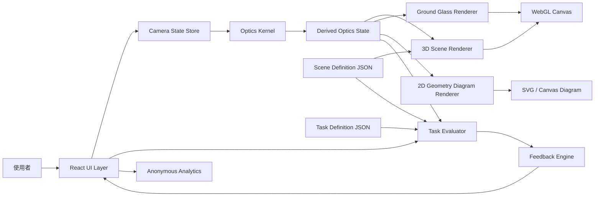
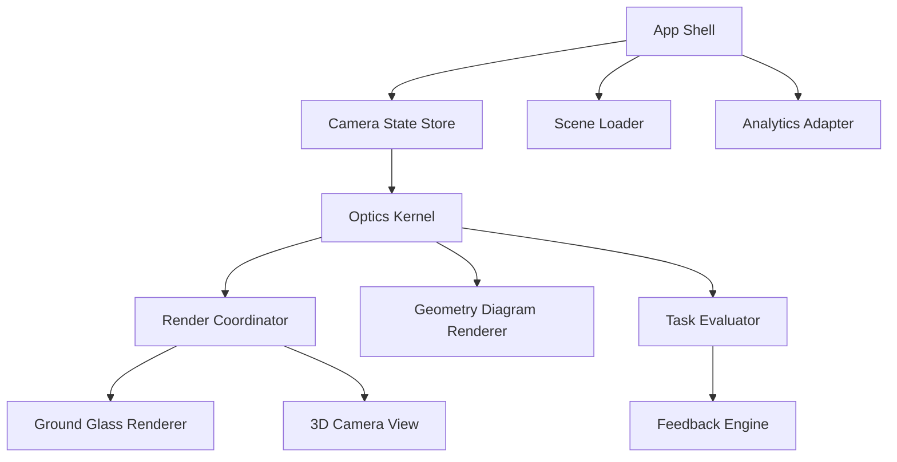
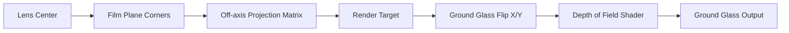
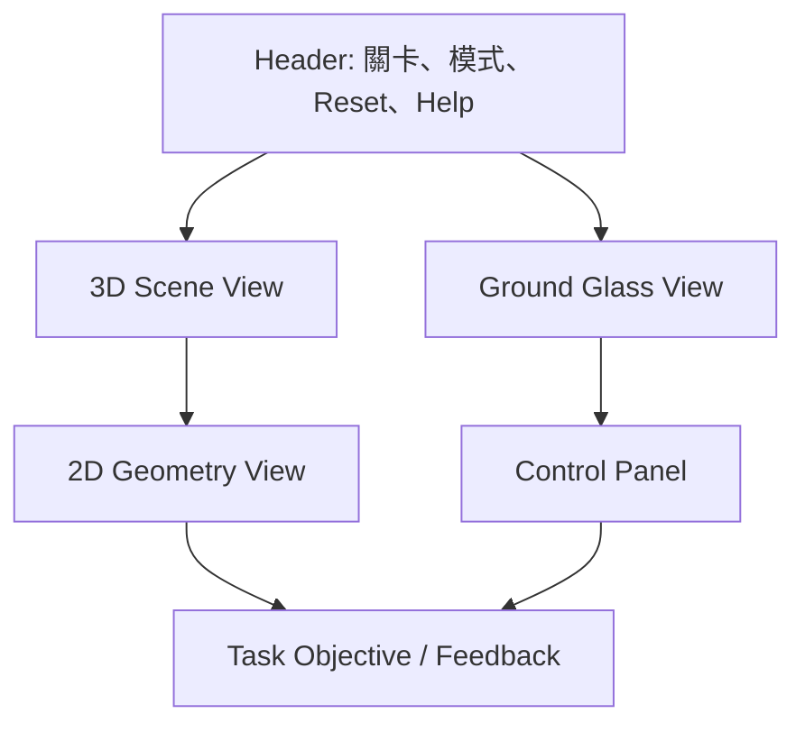
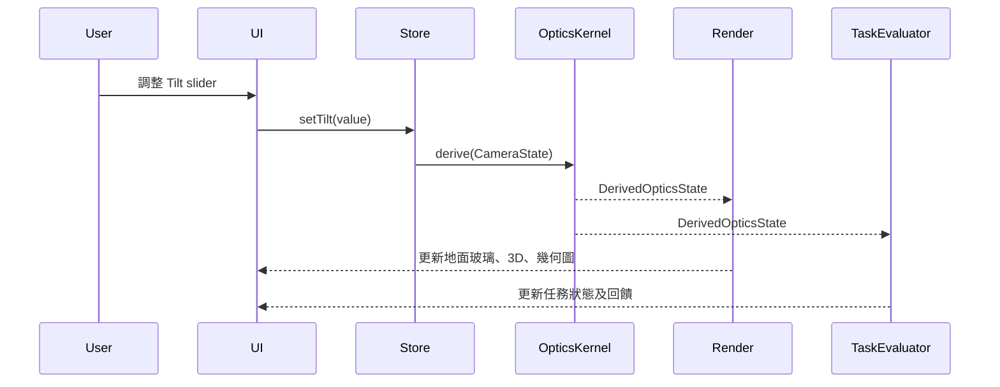

# 大片幅相機移軸互動模擬器

## 系統設計文件（SDD）

**產品名稱（暫定）**：View Camera Movement Simulator
**文件版本**：MVP v0.1
**文件狀態**：Draft
**系統類型**：Client-side Web Application
**目標平台**：Desktop Web Browser

---

# 1. 文件目的

本文件定義「大片幅相機移軸互動模擬器」MVP 的技術架構、模組責任、資料模型、幾何計算、渲染流程、關卡判定、效能要求及測試策略。

系統目標是以可互動方式，讓使用者理解以下大片幅前組 movement：

* Rise
* Tilt
* Swing
* Focus
* Aperture 對景深的影響

MVP 不追求逐光線級別的真實光學模擬，而是提供一個幾何關係正確、視覺結果一致、適合教學的薄透鏡近似模型。

---

# 2. 系統範圍

## 2.1 MVP 包含範圍

* 單一 4×5 虛擬大片幅相機。
* 單一 150mm 標準鏡頭預設。
* 前組 rise、tilt、swing 控制。
* 手動 focus 控制。
* 光圈設定及教學級景深模擬。
* 3D 場景及相機模型。
* 地面玻璃預覽。
* 2D 側視與俯視幾何圖。
* 三個關卡：

  * 建築 rise。
  * 桌面 tilt。
  * 斜向主體 swing。
* Guided Mode。
* Free Practice Mode。
* 前端本地狀態管理。
* 匿名事件分析。

## 2.2 MVP 不包含範圍

* Rear movement。
* Front shift、fall。
* 多片幅格式。
* 多鏡頭資料庫。
* 真實鏡頭像差、色散、散景葉片、邊緣銳度差異。
* 真正光線追蹤。
* 底片、片盒、暗片、快門流程。
* 登入、帳戶、雲端儲存。
* 使用者上載自訂場景。
* 手機優先操作介面。

---

# 3. 設計原則

## 3.1 教學正確性優先於視覺寫實

系統必須優先呈現：

* 正確的相機平面關係。
* 正確的焦平面方向變化。
* Rise 對取景範圍的影響。
* Tilt 與 swing 對焦平面的影響。
* 光圈對景深的影響。

系統不必模仿特定品牌鏡頭的畫質風格。

## 3.2 單一狀態來源

所有視圖必須由同一份相機狀態推導：

* 3D 相機模型。
* 地面玻璃。
* 2D 幾何圖。
* 焦平面。
* 景深模糊。
* 關卡成功判定。

不得讓不同畫面各自使用不一致的模擬邏輯。

## 3.3 由簡入深

Guided Mode 中，每一關只開放必要控制：

| 關卡    | 可用控制                 |
| ----- | -------------------- |
| Rise  | Rise、Focus、Aperture  |
| Tilt  | Tilt、Focus、Aperture  |
| Swing | Swing、Focus、Aperture |

Free Practice Mode 才同時開放所有 MVP 控制。

---

# 4. 高層系統架構



---

# 5. 技術架構

## 5.1 前端技術選型

| 層級                    | 建議技術                                                   |
| --------------------- | ------------------------------------------------------ |
| 程式語言                  | TypeScript                                             |
| UI Framework          | React                                                  |
| Build Tool            | Vite                                                   |
| 3D Rendering          | Three.js                                               |
| React 3D Binding      | React Three Fiber                                      |
| 2D 幾何圖                | SVG 或 Canvas                                           |
| 狀態管理                  | Zustand                                                |
| 數學運算                  | gl-matrix 或 Three.js MathUtils                         |
| 測試                    | Vitest、React Testing Library、Playwright                |
| WebGL Post-processing | Three.js EffectComposer / 自訂 Shader                    |
| 靜態部署                  | Cloudflare Pages、Vercel、Netlify 或 Nginx Static Hosting |

## 5.2 架構決策

### ADR-01：MVP 採純前端架構

MVP 不需要帳戶、雲端資料或多人協作，因此採用純前端靜態網站架構。

優點：

* 部署簡單。
* 延遲低。
* 成本低。
* 不需要後端維護。
* 可離線快取核心資源。

### ADR-02：採 WebGL 而非預先渲染影片

使用者需要即時調整 rise、tilt、swing、focus 及 aperture，因此必須採用即時 3D 渲染。

### ADR-03：採薄透鏡教學模型而非完整 ray tracing

完整光線追蹤雖可更寫實，但不符合 MVP 的效能與複雜度要求。

MVP 使用：

* 幾何投影。
* 平面焦點模型。
* Circle of Confusion 近似。
* 螢幕空間景深模糊。

---

# 6. 系統模組設計



## 6.1 App Shell

負責：

* 頁面路由。
* 模式切換。
* 關卡選擇。
* Simulator Workspace 版面。
* Help overlay。
* Loading、錯誤及 WebGL 不支援提示。

## 6.2 Camera State Store

負責保存及更新：

* Rise。
* Tilt。
* Swing。
* Focus distance。
* Aperture。
* Ground glass orientation assist。
* Focus assist。
* Active scene。
* Active task。
* Guided Mode / Free Mode。

## 6.3 Optics Kernel

負責：

* 鏡頭平面計算。
* 底片平面計算。
* 光軸計算。
* 焦平面計算。
* 景深近似範圍。
* Ground glass 投影參數。
* Circle of Confusion 模糊係數。
* 供 3D、2D、關卡判定共用的衍生資料。

此模組不依賴 React 或 UI。

## 6.4 Scene Loader

負責載入：

* 3D 場景模型。
* 關鍵物件。
* 對焦標記。
* 關卡可視目標。
* 相機初始位置。
* 初始相機設定。

## 6.5 Render Coordinator

負責同步：

* 主 3D 場景。
* Ground glass render target。
* Depth render target。
* 景深 post-processing。
* 2D 幾何圖需要的相機資料。

## 6.6 Ground Glass Renderer

負責：

* 呈現虛擬 4×5 地面玻璃畫面。
* 套用上下及左右反轉。
* 套用景深模糊。
* 顯示格線、中心線、放大鏡與 focus assist。

## 6.7 Geometry Diagram Renderer

負責：

* 側視圖。
* 俯視圖。
* 顯示鏡頭平面。
* 顯示底片平面。
* 顯示焦平面。
* 顯示景深近似區域。
* 顯示光軸與主要交點。

## 6.8 Task Evaluator

負責：

* 關卡目標判定。
* 清晰度判定。
* 構圖判定。
* Movement 使用限制判定。
* 分數與完成狀態。
* 操作提示觸發。

## 6.9 Feedback Engine

負責根據使用者目前設定與關卡狀態，產生可讀性高的回饋，例如：

* 建築頂部尚未進入畫面。
* Rise 已足夠，但 focus 不正確。
* Tilt 過量，遠端主體已離開焦平面。
* 使用者過度依賴小光圈。
* Swing 方向與主體方向相反。

---

# 7. 座標系統與幾何模型

## 7.1 世界座標定義

系統使用右手座標系統：

| 軸向  | 定義         |
| --- | ---------- |
| X 軸 | 向右         |
| Y 軸 | 向上         |
| Z 軸 | 由相機向被攝場景延伸 |

相機預設朝向 +Z。

```text
            +Y
             |
             |
             +------ +X
            /
           /
         +Z
```

## 7.2 基本平面

系統定義三個主要平面：

| 平面          | 說明                                                |
| ----------- | ------------------------------------------------- |
| Film Plane  | 後組固定的 4×5 底片平面                                    |
| Lens Plane  | 前組鏡頭板所在平面，可 rise、tilt、swing                       |
| Focus Plane | 由 lens plane、film plane 與 focus distance 推導的被攝焦平面 |

## 7.3 前組 movement 定義

### Rise

MVP 中，rise 定義為鏡頭中心沿世界 Y 軸的垂直位移。

```text
lensCenter.y = baseLensCenter.y + frontRiseMm
```

### Tilt

Tilt 定義為鏡頭平面繞 X 軸旋轉。

```text
R_tilt = rotateX(frontTiltDeg)
```

### Swing

Swing 定義為鏡頭平面繞 Y 軸旋轉。

```text
R_swing = rotateY(frontSwingDeg)
```

### 鏡頭平面最終旋轉

```text
R_lens = R_swing × R_tilt
```

鏡頭法線：

```text
lensNormal = R_lens × (0, 0, 1)
```

---

# 8. 相機狀態模型

```ts
export type CameraState = {
  focalLengthMm: number;
  aperture: number;
  focusDistanceMm: number;

  frontRiseMm: number;
  frontTiltDeg: number;
  frontSwingDeg: number;

  groundGlassAssistEnabled: boolean;
  focusAssistEnabled: boolean;
  gridEnabled: boolean;

  activeSceneId: string;
  activeTaskId?: string;
  mode: "guided" | "free";
};
```

預設值：

```ts
export const defaultCameraState: CameraState = {
  focalLengthMm: 150,
  aperture: 11,
  focusDistanceMm: 2000,

  frontRiseMm: 0,
  frontTiltDeg: 0,
  frontSwingDeg: 0,

  groundGlassAssistEnabled: false,
  focusAssistEnabled: true,
  gridEnabled: true,

  activeSceneId: "architecture-rise",
  activeTaskId: "rise-01",
  mode: "guided",
};
```

---

# 9. 衍生光學狀態

所有 renderer 及 evaluator 必須使用同一份 `DerivedOpticsState`。

```ts
export type DerivedOpticsState = {
  lensCenterWorld: Vec3;
  lensNormalWorld: Vec3;
  lensPlane: Plane;

  filmCenterWorld: Vec3;
  filmNormalWorld: Vec3;
  filmPlane: Plane;

  opticalAxisWorld: Ray;

  focusPointWorld: Vec3;
  focusPlane: Plane;

  depthOfFieldNearPlane: Plane;
  depthOfFieldFarPlane: Plane;

  groundGlassProjection: ProjectionData;
  imageCircleData: ImageCircleData;
};
```

---

# 10. 焦平面計算設計

## 10.1 目的

Tilt 與 swing 必須讓使用者看到焦平面方向改變，而不是只看到整體畫面模糊程度改變。

系統採用符合 Scheimpflug 關係的教育級焦平面模型。

## 10.2 無 tilt／swing 時

當 tilt 與 swing 接近 0：

* Lens plane 與 film plane 近似平行。
* Focus plane 亦近似平行於 film plane。
* Focus point 位於光軸上。

```text
focusPoint = lensCenter + opticalAxisDirection × focusDistance
focusPlane.normal = filmPlane.normal
focusPlane.point = focusPoint
```

## 10.3 有 tilt 或 swing 時

當 lens plane 與 film plane 不平行時：

1. 求 lens plane 與 film plane 的交線。
2. 取得交線方向 `hingeDirection`。
3. 在光軸上建立 focus point。
4. 建立一個同時通過交線及 focus point 的 focus plane。

概念上：

```text
film plane
      \
       \  common intersection line
        \
lens plane

focus plane 必須經過共同交線，
並同時經過目前 focus point。
```

焦平面法線計算：

```text
hingeDirection = normalize(cross(filmNormal, lensNormal))

focusPlaneNormal =
  normalize(cross(hingeDirection, focusPoint - hingePoint))
```

其中：

* `hingePoint` 為 lens plane 與 film plane 交線上的任意點。
* `focusPoint` 為目前 focus distance 對應的光軸位置。

## 10.4 數值穩定性

當 tilt 與 swing 非常接近 0 時，兩個平面近似平行，交線計算可能不穩定。

處理規則：

```text
if angleBetween(lensNormal, filmNormal) < epsilon:
    use parallel focus plane model
else:
    use Scheimpflug focus plane model
```

建議：

```text
epsilon = 0.1 degree
```

---

# 11. 地面玻璃投影設計

## 11.1 基本原則

地面玻璃預覽不應只是一般 perspective camera 畫面。

系統必須使用 lens center、film plane 與焦距建立 off-axis projection，使 rise 對構圖的影響能正確呈現。

## 11.2 投影計算

Ground glass renderer 需根據以下資料建立 projection：

* Lens center。
* Film plane center。
* Film plane 四角。
* Film plane orientation。
* Focal length。
* Rise。
* Tilt。
* Swing。

投影流程：



## 11.3 地面玻璃反轉

真實大片幅地面玻璃通常呈現：

* 上下倒轉。
* 左右反轉。

MVP 預設保留此效果。

實作方式：

```text
UV.x = 1.0 - UV.x
UV.y = 1.0 - UV.y
```

當使用者開啟方向輔助時，不套用反轉。

---

# 12. 景深與模糊設計

## 12.1 模擬原則

景深模擬的目標是讓使用者理解：

* Focus plane 是方向。
* Aperture 是容許清晰範圍。
* Tilt 與 swing 會改變清晰區方向。
* 小光圈不能完全取代正確 movement。

## 12.2 資料來源

Ground glass renderer 需要：

* Color render target。
* Depth render target。
* Camera inverse projection matrix。
* Camera world matrix。
* Focus plane。
* Aperture。
* Focus distance。

## 12.3 每像素清晰度估算

每個 pixel：

1. 從 depth texture 重建 world position。
2. 計算該位置與 focus plane 的距離。
3. 根據 aperture 計算容許清晰範圍。
4. 將距離轉換為 blur radius。
5. 套用 shader-based blur。

概念公式：

```text
distanceToFocusPlane =
  abs(dot(focusPlaneNormal, worldPosition - focusPlanePoint))

acceptableSharpnessRange =
  baseTolerance × apertureFactor

blurStrength =
  clamp(
    distanceToFocusPlane / acceptableSharpnessRange,
    0,
    maxBlurStrength
  )
```

## 12.4 教學級近似

此模型不是鏡頭測試工具，不保證：

* 真實散景形狀。
* 焦外高光。
* 貓眼散景。
* 色散。
* 鏡頭邊緣像差。
* 特定鏡頭的球面像差。

介面需標示：

> 景深效果為教學級光學近似，用於展示焦平面與光圈關係。

---

# 13. 3D 場景設計

## 13.1 場景格式

每個場景由 JSON 定義：

```ts
export type SceneDefinition = {
  id: string;
  title: string;
  description: string;

  assetUrl: string;

  cameraPreset: {
    position: Vec3;
    heightMm: number;
    focusDistanceMm: number;
    aperture: number;
    riseMm: number;
    tiltDeg: number;
    swingDeg: number;
  };

  focusTargets: FocusTarget[];
  compositionTargets?: CompositionTarget[];
};
```

## 13.2 對焦目標

```ts
export type FocusTarget = {
  id: string;
  label: string;
  worldPosition: Vec3;
  requiredSharpness: number;
  weight: number;
};
```

用途：

* 關卡成功判定。
* 顯示 focus assist。
* 產生操作回饋。
* 顯示「近景／中景／遠景」關鍵物件。

## 13.3 場景清單

| 場景 ID               | 名稱      | 主要 movement |
| ------------------- | ------- | ----------- |
| `architecture-rise` | 高樓立面    | Rise        |
| `table-tilt`        | 桌面靜物    | Tilt        |
| `shelf-swing`       | 斜向書架／走廊 | Swing       |

---

# 14. 關卡系統設計

## 14.1 任務資料模型

```ts
export type TaskDefinition = {
  id: string;
  sceneId: string;
  title: string;
  learningObjective: string;

  enabledControls: Array<
    "rise" | "tilt" | "swing" | "focus" | "aperture"
  >;

  constraints: {
    maxAperture?: number;
    riseRangeMm?: [number, number];
    tiltRangeDeg?: [number, number];
    swingRangeDeg?: [number, number];
  };

  successCriteria: SuccessCriterion[];
  feedbackRules: FeedbackRule[];
};
```

## 14.2 成功條件類型

```ts
export type SuccessCriterion =
  | {
      type: "focusTargetsSharp";
      targetIds: string[];
      minimumSharpness: number;
    }
  | {
      type: "compositionTargetVisible";
      targetId: string;
      minimumCoverage: number;
    }
  | {
      type: "movementUsed";
      movement: "rise" | "tilt" | "swing";
      minimumAbsoluteValue: number;
    }
  | {
      type: "movementWithinRange";
      movement: "rise" | "tilt" | "swing";
      range: [number, number];
    };
```

## 14.3 關卡一：Rise

成功條件：

```text
- 建築頂部進入地面玻璃範圍。
- 建築主體維持至少指定比例可見。
- Rise 必須大於最低使用值。
- 不可超過場景指定最大 rise。
```

## 14.4 關卡二：Tilt

成功條件：

```text
- 近、中、遠三個桌面目標均達到可接受清晰度。
- 光圈不得小於 f/22。
- Tilt 必須在合理區間。
```

## 14.5 關卡三：Swing

成功條件：

```text
- 斜向排列的前、中、遠三個標記均可接受清晰。
- Swing 必須大於最低使用角度。
- 不能只依靠最大光圈補救。
```

---

# 15. UI 架構

## 15.1 Simulator Workspace



## 15.2 視圖區域

| 區域                | 功能                                |
| ----------------- | --------------------------------- |
| 3D Scene View     | 顯示相機、鏡頭板、皮腔及被攝物                   |
| Ground Glass View | 顯示構圖、倒像、景深及 focus assist          |
| Geometry View     | 顯示側視／俯視的平面關係                      |
| Control Panel     | 調整 rise、tilt、swing、focus、aperture |
| Feedback Panel    | 顯示任務狀態、提示、成功原因及錯誤說明               |

## 15.3 Guided Mode UI 規則

* 未開放 movement 必須 disabled。
* 不應只隱藏，而應顯示其存在及暫不可用原因。
* 顯示當前 learning objective。
* 每關最多顯示兩條主要提示。
* 避免同時彈出過多教學文字。

---

# 16. 狀態管理設計

## 16.1 Zustand Store 分組

```ts
type AppStore = {
  camera: CameraState;
  scene: SceneRuntimeState;
  task: TaskRuntimeState;
  ui: UIState;

  setRise(value: number): void;
  setTilt(value: number): void;
  setSwing(value: number): void;
  setFocusDistance(value: number): void;
  setAperture(value: number): void;

  resetMovements(): void;
  resetScene(): void;
  loadTask(taskId: string): void;
};
```

## 16.2 更新流程



---

# 17. 錯誤處理與防護

## 17.1 movement 值限制

所有輸入必須 clamp 至合理範圍：

| Movement       | 範圍                   |
| -------------- | -------------------- |
| Rise           | 0–40mm               |
| Tilt           | -10° 至 +10°          |
| Swing          | -10° 至 +10°          |
| Focus Distance | 場景指定最小值至最大值          |
| Aperture       | f/5.6、f/11、f/22、f/32 |

## 17.2 WebGL 不支援

如瀏覽器不支援 WebGL：

* 顯示明確錯誤訊息。
* 提示使用較新版本 Chrome、Edge 或 Safari。
* 不嘗試載入主要 3D 資產。

## 17.3 數值不穩定

當平面交線計算失敗或法線長度接近零：

* 回退到平行 focus plane 模型。
* 寫入 development console warning。
* 不讓 UI 崩潰。

---

# 18. 效能設計

## 18.1 目標

| 項目                             |       指標 |
| ------------------------------ | -------: |
| 控制輸入至畫面更新                      |  < 100ms |
| 一般 desktop 裝置更新率               | ≥ 30 FPS |
| Ground glass render resolution |  先採自適應縮放 |
| 初始資產載入                         | 優先 < 5 秒 |
| 場景切換                           | 目標 < 2 秒 |

## 18.2 效能策略

* 使用低至中等多邊形 3D 場景。
* 對遠距物件採簡化模型。
* Ground glass render target 解析度低於主畫面。
* Depth of field shader 以半解析度執行。
* 只於相機狀態改變時重新計算複雜幾何。
* 對 geometry diagram 採 memoization。
* 低效能裝置自動降低 post-processing 品質。

---

# 19. 可及性設計

## 19.1 鍵盤操作

所有 slider 必須支援：

* Tab 聚焦。
* Arrow keys 微調。
* Shift + Arrow keys 大步調整。
* Enter 觸發 reset 或完成確認。

## 19.2 資訊不只依賴顏色

焦點輔助除視覺覆蓋外，必須同時顯示：

* 「清晰」
* 「接近清晰」
* 「失焦」

## 19.3 動畫與視覺減敏

提供 Reduced Motion 支援：

* 關閉平滑相機動畫。
* 減少過場效果。
* 保留必要畫面更新。

---

# 20. 私隱與安全

## 20.1 MVP 資料原則

* 不要求登入。
* 不儲存個人身份資料。
* 不收集精確位置。
* 不收集使用者上載影像。
* 不在瀏覽器儲存敏感資料。

## 20.2 匿名分析事件

可選擇收集：

```text
scene_started
movement_changed
focus_changed
aperture_changed
hint_opened
scene_completed
scene_restarted
```

分析資料不得包含：

* 姓名。
* 電郵。
* IP 地址。
* 裝置唯一識別碼。
* 使用者輸入內容。

---

# 21. 測試策略

## 21.1 Unit Tests

測試範圍：

* Rise 正確改變 lens center Y 值。
* Tilt 正確改變 lens normal。
* Swing 正確改變 lens normal。
* 無 tilt／swing 時 focus plane 平行於 film plane。
* Tilt 後 focus plane 方向有變化。
* Swing 後俯視焦平面方向有變化。
* Aperture 改變景深範圍。
* Movement 值正確 clamp。
* 任務成功條件可正確觸發。

## 21.2 Integration Tests

測試範圍：

* 調整 slider 後，3D、地面玻璃、幾何圖同步更新。
* Guided Mode 僅開放指定 controls。
* Reset 可恢復初始狀態。
* 切換場景後正確載入相機預設。
* 任務達成後正確顯示結果頁。

## 21.3 End-to-End Tests

以 Playwright 測試：

1. 開啟 Rise 關卡。
2. 調整 rise 至指定範圍。
3. 驗證任務完成狀態。
4. 進入 Tilt 關卡。
5. 調整 tilt、focus 與 aperture。
6. 驗證三個 target 進入可接受清晰範圍。
7. 進入 Swing 關卡並完成。

## 21.4 視覺回歸測試

需為以下狀態建立 snapshot：

* Rise = 0mm。
* Rise = 40mm。
* Tilt = 0°。
* Tilt = +5°。
* Swing = 0°。
* Swing = +5°。
* Ground glass assist on/off。
* Focus assist on/off。

---

# 22. 建議專案目錄結構

```text
src/
  app/
    App.tsx
    routes.tsx

  components/
    SimulatorWorkspace/
    GroundGlass/
    GeometryDiagram/
    ControlPanel/
    TaskFeedback/

  core/
    optics/
      deriveOpticsState.ts
      focusPlane.ts
      depthOfField.ts
      projection.ts
      planeIntersection.ts

    geometry/
      vectors.ts
      transforms.ts
      coordinates.ts

    tasks/
      evaluateTask.ts
      feedbackRules.ts

  scenes/
    architecture-rise/
    table-tilt/
    shelf-swing/

  state/
    appStore.ts

  render/
    sceneRenderer.ts
    groundGlassRenderer.ts
    postprocessing/
      depthOfFieldPass.ts

  types/
    camera.ts
    optics.ts
    scene.ts
    task.ts

  tests/
    unit/
    integration/
    e2e/
```

---

# 23. 開發階段建議

## Phase 1：基礎骨架

* React、TypeScript、Three.js 專案初始化。
* 基本 3D 場景。
* 4×5 虛擬相機模型。
* CameraState Store。
* Rise slider。
* 基礎地面玻璃畫面。

## Phase 2：幾何與焦平面

* Lens plane。
* Film plane。
* Focus point。
* Focus plane。
* 側視與俯視 SVG 圖。
* Tilt 與 swing controls。

## Phase 3：景深與視覺化

* Depth render target。
* Ground glass post-processing。
* Circle of Confusion 近似。
* Focus assist overlay。
* 放大鏡功能。

## Phase 4：關卡與回饋

* 任務 JSON。
* Task evaluator。
* Rise、tilt、swing 三個關卡。
* Feedback engine。
* 結果頁。

## Phase 5：測試與優化

* Unit tests。
* Playwright E2E tests。
* 視覺 regression tests。
* 低效能裝置調校。
* 可及性檢查。
* 匿名分析事件。

---

# 24. MVP 完成定義

系統可視為 MVP 完成，必須符合以下條件：

* 使用者可於 desktop browser 開啟三個互動場景。
* 使用者可調整 rise、tilt、swing、focus 及 aperture。
* 3D 相機、地面玻璃及 2D 幾何圖由同一份狀態驅動。
* Rise 可明確改變地面玻璃垂直取景。
* Tilt 可明確改變側視焦平面方向。
* Swing 可明確改變俯視焦平面方向。
* Aperture 可改變景深寬度。
* 三個關卡均有可量化成功條件。
* 關卡完成後提供可理解的操作回饋。
* 系統在一般 desktop 瀏覽器中維持可用流暢度。
* 所有核心幾何運算均有 unit tests 覆蓋。

---

# 25. 未來擴充方向

MVP 架構需保留以下擴充能力：

* Rear rise、tilt、swing。
* Front shift、fall。
* 鏡頭像圈與暗角。
* 多鏡頭及多片幅支援。
* 皮腔延伸及曝光補償。
* 底片裝載及快門流程。
* 更精確的景深與光學模擬。
* 教師模式與學生學習紀錄。
* 自訂場景與自訂任務。
* 多語言介面。
