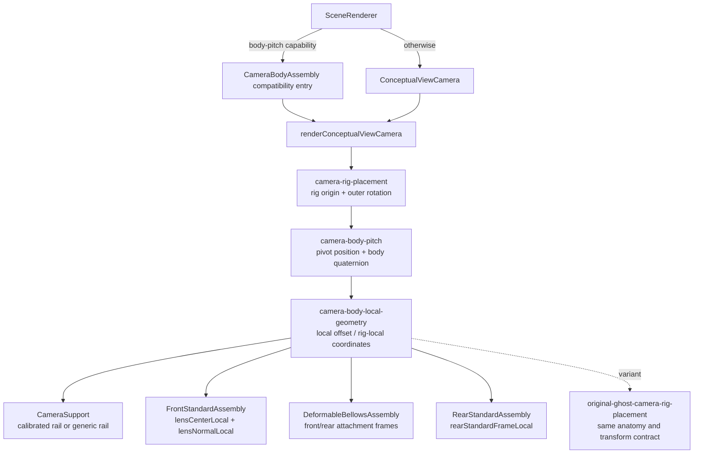
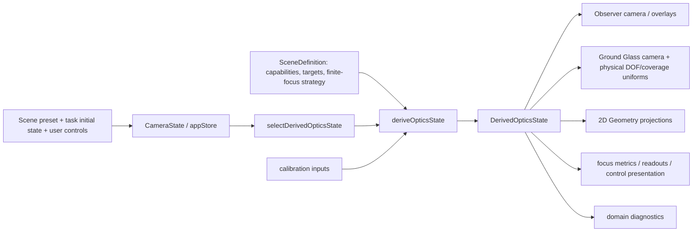
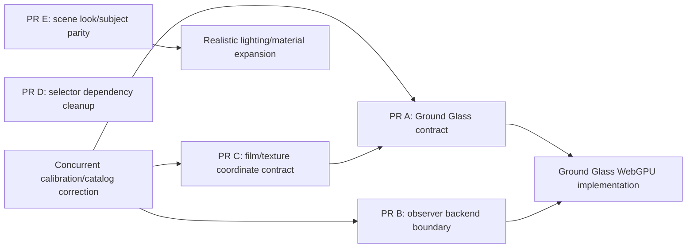
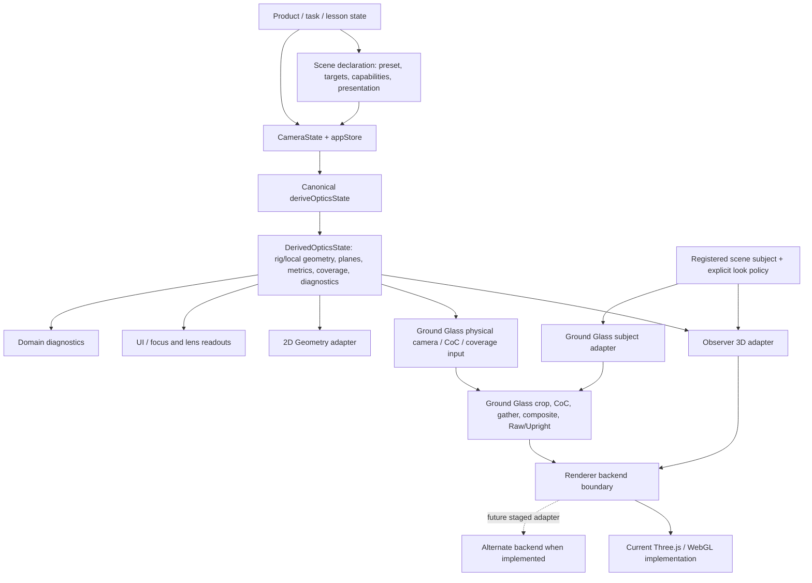

# View Camera Simulator Architecture Diagnosis

> **Audit status:** Initial snapshot diagnosis. The required delta review after the concurrent Ground Glass/lens correction merges is pending. This document and its PR are intentionally provisional until that review is complete.

## 1. Scope and repository snapshot

This is a read-only architecture audit of the simulator after PR #202. It examines scene ownership, camera assembly, canonical optics, lens coverage, Ground Glass, coordinate conversions, global overlays, renderer boundaries, tests, WebGPU readiness, and readiness for more detailed lighting and materials. No runtime or test files were changed for this audit.

| Item | Initial audit value |
|---|---|
| Repository | `chau-hm/view-camera-simulator` |
| `origin/main` snapshot | `1d6f68b4bdd6350e843b4bd7338ae483ae52b1f2` |
| Snapshot title | `fix(simulator): restore camera assembly containment and cross-scene optical consistency (#202)` |
| Audit branch | `docs/architecture-diagnosis` |
| Corrective PR | None found in the remote PR listing at audit time; no PR number/head/status to record. A local corrective worktree existed at the same base without changes. |
| Final refreshed main SHA | **Pending corrective PR merge and delta review** |

The findings below describe the initial snapshot only. In particular, current Ground Glass blur calibration and the published lens coverage definitions are marked unstable in §2. The audit is not complete until §26 is updated against the correction merge.

## 2. Concurrent corrective-work notice

Two product behaviours are known to be under correction and are excluded from the architecture defect count:

1. `src/render/groundGlassVisualSettings.ts` currently sets a global `displayBlurScale` of `16`, which was observed to make ordinary focus scenes look too blurred. This multiplier is a current display calibration choice, not the target architecture.
2. `src/core/optics/lensCatalog.ts` currently assigns `unbounded-ideal` to its published 90, 105, and 120 mm definitions. The 150 mm profile is angular and parametric. The intended correction is finite teaching coverage for all published focal lengths. This snapshot must not be used to conclude that the 120 mm Mirror Shift scene is meant to lack finite coverage.

The stable architectural conclusion is that physical CoC/coverage state is derived separately from display policy, and the lens catalog is the authority for lens coverage semantics. After the correction merges, refresh the Ground Glass display policy, CoC storage range, catalog policy, Mirror Shift coverage path, and related regression evidence before calling this diagnosis final.

## 3. Executive summary

| Question | Diagnosis |
|---|---|
| **Camera** | **Mostly self-contained with defined exceptions.** The simulator owns a shared rig-placement root and local camera-part hierarchy; current and ghost cameras use the same renderer. The calibrated camera-movement rail and anatomy presentation are deliberate inputs. |
| **Scenes** | Scene definition, publication, tasks, subject registration, and renderer policy are distinct systems. The boundary is healthy, with scene-ID dispatch spread across a few domain and presentation modules. Registered subjects are executable renderer code, so the contract prevents direct access to canonical camera state by convention rather than type isolation. |
| **Optics** | One canonical `deriveOpticsState` path supplies the important physical planes, coverage, focus metrics, and camera geometry. React and renderer code adapt that state. Scene-specific physical strategies are intentional; a cache key omission around Mirror Shift lesson state is a latent exception. |
| **Ground Glass** | Physical optics and visible blur are separated conceptually: canonical planes and coverage enter a renderer adapter; pixel CoC, gathers, display blur, crops, and Raw/Upright presentation are renderer work. The active pipeline is still directly coupled to Three.js/WebGL, and a renderer DOF hint is written into optics diagnostics. |
| **Coordinates** | The highest-risk coordinate chain is world millimetres → rear-standard film basis → RTT source UV → WebGL texture sampling → Raw/Upright display transform → CSS top-origin interactions. The conversions are mostly explicit and tested. Misleading `*World` field names inside rig-local camera geometry are a smaller naming hazard. |
| **Global features** | Shared coverage and focus features are derived from canonical state; visibility is controlled separately. Mirror Shift's current missing circle is the catalog capability result for 120 mm in this snapshot, not scene-specific renderer suppression. A finite lens profile should flow through the shared path. |
| **Renderer** | The highest migration risk is Ground Glass: an inner R3F Canvas owns a direct WebGL render-target and custom GLSL multipass pipeline, with no backend selection seam. Observer and Ground Glass also construct separate subject representations. |
| **WebGPU** | Staged migration can be planned after the correction, without redesigning canonical optics or scenes. Before moving the active Ground Glass path, define and test its pass/resource/backend contract and preserve the physical film/UV orientation contract. Migrate the observer renderer first and the Ground Glass postprocess last. |
| **Realistic visuals** | Wait to increase scene detail until the R3F/RTT subject parity, lighting placement, and material ownership are deliberate. Current simple educational visuals do not justify a wholesale scene or camera rewrite. |

At the initial snapshot, the diagnosis records **1 Must-fix-before-WebGPU finding, 2 Should-fix-before-realistic-expansion findings, and 4 small cleanup findings**. There are no architectural findings caused solely by the two concurrent product corrections.

## 4. Current ownership map

| Responsibility | Current owner | Declarative / executable | Can affect optics? | Can affect rendering? | Risk |
|---|---|---|---|---|---|
| Scene identity, copy, bounds, focus/composition targets, preset | `SceneDefinition` in `src/types/scene.ts`; concrete values in `src/scenes/definitions/*.ts` | Declarative | Yes, through targets, presets, bounds, and finite-focus strategy | Yes, framing and subject adaptation | Healthy contract; some later dispatch still keys on scene ID |
| Public availability, route mode, task/lesson metadata | `src/app/publicScenes.ts`, `src/config/scenePublication.ts`, task registry and `src/app/guidedLesson.ts` | Declarative plus route/evaluation code | Task initial camera state can affect derived optics | Controls, navigation, evaluation | Separate registration gates; new scene must be added consistently |
| Movement/focus/lens/rig capabilities and control policy | Optional fields on `SceneDefinition` | Declarative, consumed by store/UI/core | Yes for enabled physical movement/focus geometry; focal length changes lens profile | Yes for control availability/locks | Movement capability also carries UI presentation (`hideUnavailableControls`, `selectionMode`) |
| Subject geometry | `sceneSubjectRegistry` in `src/render/sceneSubjectRegistry.tsx` | Executable React subject and imperative RTT factory | No direct canonical-optics mutation in the current contract | Yes, observer and Ground Glass subject graphs | Separate executable representations can drift |
| Scene-specific RTT framing, lights, shadows, bounds | `sceneSubjectRegistry` plus `groundGlassSceneProfiles.ts` | Executable renderer configuration | No direct optical formula authority | Yes | Explicit but distributed across two renderer maps |
| Camera physical state | `CameraState` and store/actions | State | Yes; input to canonical derivation | Yes, through derived state | Custom lesson state and presentation flags share the broad state container |
| Camera geometry and optical quantities | `deriveOpticsState` and helpers in `src/core/optics` | Deterministic domain calculation | Authoritative | Indirectly, through consumers | Healthy central authority; special-case branches and one latent selector-key gap |
| Camera assembly rendering | `ConceptualViewCamera` / `CameraBodyAssembly` | Executable renderer adapter | No | Yes | Shared hierarchy is healthy; support rail has calibrated/generic paths |
| Lens coverage definition | `lensCatalog.ts`, `LensDefinition` | Declarative lens data plus canonical derivation | Yes | Yes, via overlay and Ground Glass mask | Catalog data is unstable for three published profiles at this snapshot |
| Ground Glass physical coverage/focus state | `DerivedOpticsState` | Derived domain state | Yes | Consumed by mask, projection, readouts | Healthy separation from overlay visibility |
| Ground Glass pixel pipeline and display interactions | `GroundGlassRTT`, shaders, `GroundGlassStage` | Executable renderer and UI | Does not update canonical physical optics | Yes | High backend coupling; presentation calibration is pending correction |
| Optical overlay visibility | `appStore.ui.showOpticalGeometry`, task initial state, overlay props | UI state | No | Yes | Generally distinct from capability; lesson can hide presentation |
| Diagnostics | canonical `DerivedOpticsState.diagnostics`, RTT runtime info, `?rttDiagnostics=1` | Domain and renderer telemetry | Some are diagnostic summaries only | Yes | RTT telemetry is useful; one renderer-selected DOF hint crosses into optics diagnostics |
| Asset metadata | `SceneDefinition.assets` and preload helpers | Declarative metadata | No | Intended to; current `SceneAssetMesh` returns `null` | Names overstate current executable asset boundary; registered subjects draw current geometry |

### What a scene can and cannot do

1. **Purely declarative properties** include IDs, descriptive metadata, assets/preload hints, bounds, camera preset/placement, focus and composition targets, movement/focus/lens capabilities, finite-focus strategy, camera control policy, and reference-camera policy.
2. **Executable scene behavior** lives outside `SceneDefinition`: registered React/Three subjects, `createRttGroup`, RTT profile callbacks, task evaluators, store transitions, and scene-ID switches in core and renderer modules.
3. **Canonical optics inputs** include a scene's preset and enabled movement/focus capabilities, focus targets, and `finiteFocusStrategy`; these are consumed before rendering.
4. **Presentation-only inputs** include observer `cameraPlacement`/`cameraInspectionPlacement`, geometry-view profile, overlay toggles, subject/light placement, and camera anatomy presentation overrides. They do not change the physical camera/film state.
5. A scene cannot directly position camera subparts through its subject registration: the current registered subject API receives scene and subject options, not `CameraState` or `DerivedOpticsState`. However, this is a convention enforced by API shape, not a sandbox around executable React/Three code.
6. No current scene subject changes Ground Glass physical semantics. Scene settings can select a Ground Glass DOF presentation/model hint, clipping/framing, lighting, shadow participation, and subject; canonical physical coverage still comes from `DerivedOpticsState`.
7. Missing scene configuration does not set canonical coverage geometry or silently turn off an overlay. It can affect control defaults or cause registration/RTT omissions. `sceneSubjectRegistry.test.tsx` requires every available public scene to have an RTT scene entry, React subject, and RTT factory, reducing that omission risk.

The boundary is therefore **strong enough to prevent the common accidental coupling** (a scene cannot adjust the camera assembly through current public scene APIs), but not enough to make scene additions a single-file operation. A new public scene is intentionally registered in multiple maps and validated across them.

## 5. Scene contract

### Registries and the 15 current public scenes

`src/scenes/definitions/index.ts` registers and orders 15 scene definitions. `src/app/publicScenes.ts` independently configures public groups, modes, route/task/lesson integration and availability; `src/config/scenePublication.ts` is an explicit publication allowlist. Task definitions, guided lesson staging, and renderer subjects remain separately owned. This split makes incomplete scenes possible without automatically publishing them and is protected by route/catalog validators.

| Teaching area | Scene IDs |
|---|---|
| Foundations | `view-camera-anatomy`, `understanding-camera-movements`, `focus-fundamentals-two-targets` |
| Architecture and movements | `architecture-rise`, `architecture-foreground`, `table-tilt`, `shelf-swing`, `oblique-tabletop`, `mirror-shift`, `oblique-architecture`, `interior-corner` |
| Macro | `macro-bellows-extension`, `macro-depth-of-field`, `macro-oblique-plane`, `macro-compound-movements` |

Every current public scene is in the Ground Glass RTT allowlist and registered subject map. The dual per-scene contracts are explicit and tests assert the set. This is acceptable while the public catalog is small; it is a maintenance cost, not proof that a new registry abstraction is needed today.

### Intentional special behavior vs. accumulated dispatch

Several scene-specific branches represent real teaching contracts, not accidental scene control over global rendering:

| Scene-specific behavior | Current location | Classification |
|---|---|---|
| Continuous viewpoint/body movement lesson state and calibrated camera rail | `deriveOpticsState.ts`, `understandingCameraMovementsGeometry.ts`, `CameraBodyAssembly.tsx`, `SceneRenderer.tsx` | Intentional teaching adapter; still a multi-module contract |
| Mirror Shift rig lateral state and parallax lesson | `mirrorShiftLessonState.ts`, `deriveOpticsState.ts`, `appStore.ts`, RTT profile | Intentional domain behavior; the state has a latent selector cache-key omission (§7) |
| Table Tilt focus geometry and Ground Glass DOF mode | `deriveOpticsState.ts` | Intentional canonical optics specialization: the core `isTableTilt || Scheimpflug-wedge` branch selects derived-plane Ground Glass semantics; its renderer visual setting remains `planeMode: "automatic"` |
| Shelf Swing Ground Glass DOF display mode | `groundGlassVisualSettings.ts`, `resolveGroundGlassDisplayOpticsState()` | Intentional presentation specialization: renderer policy selects derived planes even at neutral/zero swing, then copies that selection into optics diagnostics; this is the renderer-to-domain leak to clean up |
| Focus Fundamentals selected standard, reference camera, and compact geometry view | `deriveOpticsState.ts`, `SceneRenderer.tsx`, `geometryPresentationProfiles.ts` | Intentional lesson behavior; presentation and optical branches are spread out |
| Architecture Rise DOF fallback and special plane display | `deriveOpticsState.ts`, renderer | Historical scene-specific stabilization; should remain explicit and tested until generalized evidence supports removal |
| Default geometry view, diagram window, annotation and Scheimpflug presentation | `geometryPresentationProfiles.ts` keyed by scene ID | Presentation map, not optical state; small dispatch debt |
| Interior Corner guided lesson state retention | `appStore.ts`, lesson/task modules | Intentional route/task lifecycle behavior |

The special cases are not uniformly architectural debt. The useful cleanup target is discoverability and dependency clarity: maintainers currently need to search `deriveOpticsState`, `appStore`, geometry profiles, `SceneRenderer`, RTT profiles, and multiple allowlists to trace one scene. Do not replace these with a broad capability framework solely for consistency.

## 6. Camera assembly

### Post-#202 transform hierarchy

`SceneRenderer` chooses `CameraBodyAssembly` when the scene declares camera body pitch capability and otherwise renders `ConceptualViewCamera`. `CameraBodyAssembly` is now a compatibility entrypoint that calls `renderConceptualViewCamera`; it supplies the calibrated rail from `understandingCameraMovementsGeometry`. Both entries use the same parts and root contract.



### Answers to camera audit questions

1. **Authoritative root:** `camera-rig-placement` in `renderConceptualViewCamera()` (`src/render/ConceptualViewCamera.tsx`). The ghost has a distinct root name but uses the same `cameraRigTransform` composition.
2. **Physical parts:** Front/rear standard, lens, bellows, rear frame, and support assembly are built from `cameraBodyLocalGeometry` or frames derived from it and rendered below the common local geometry group.
3. **World placement:** `cameraRigTransform` is the authority. The renderer applies its rig placement and body-pitch transform once to the rendered group hierarchy. Core `applyCameraRigTransform()` applies the corresponding transform to world-space optical outputs. This is one application within each consumer representation, not two nested renderer applications.
4. **Body pitch:** Local body pitch around `bodyPitchPivotRigLocal` precedes outer/base rig pitch and origin translation. The hierarchy and `applyCameraRigTransform()` implement that same order.
5. **Front/rear focus and movements:** Canonical standards geometry is derived from movements, focus mode, and selected focus standard; the renderer receives lens/rear frame geometry from the derived local values. Components do not independently infer movement positions.
6. **Support rail:** The generic rail is assembled in rig-local space and derives its reference center from the rear-standard local center. The camera-movement lesson passes its calibrated rail explicitly. Thus the rail is under the shared root, but its shape/dimensions are not all derived from canonical optics.
7. **Ghost/reference camera:** The original camera path builds a derived baseline/reference optics state and calls the shared camera renderer with `variant="ghost"`; it does not have a parallel camera-part transform implementation.
8. **Lesson 0:** `view-camera-anatomy` uses the same assembly. `cameraPresentation` changes visible anatomy, rear-back mode, aperture, and the camera-local image-circle hint. These are teaching presentation inputs, not a second physical camera.
9. **Scene coupling:** No registered subject re-parents or positions current camera subparts. The camera movement scene influences the rail and `cameraBodyPitchCapability` chooses the compatibility entry, but both flow into the same renderer root.

### Self-contained classification

**Mostly self-contained with defined exceptions.** It meets the key criteria of one shared root, a stable parent/child hierarchy, one canonical transform authority, optics-derived standards geometry, use across scenes, and a matching ghost/reference contract.

Concrete exceptions:

- The compatibility wrapper selects a scene-calibrated rail. Other scenes use the shared component's generic rig-local rail.
- A scene capability currently selects the compatibility wrapper even though it delegates to the same root; this is no longer a meaningful alternate assembly.
- Lesson 0 deliberately overrides visual camera anatomy without changing canonical physical geometry.
- Some coordinate members in `StandardFrame` have legacy `*World` suffixes although `rearStandardFrameLocal` stores rig-local values (§11).

Do not recommend another camera assembly rewrite. PR #202 addressed the substantive camera-part drift boundary.

## 7. Canonical state and optics authority

### State flow



`selectDerivedOpticsState()` selects a scene and calls `deriveOpticsState()`; the latter has finite-focus, infinity-focus, focus-standard and fallback paths, but publishes one `DerivedOpticsState`. This is the canonical source for lens centre/normal/plane, film plane/corners, rear frame, optical axis, focus plane, near/far DOF planes, off-axis projection values, focus-target metrics, lens coverage, Ground Glass coverage/illumination, camera rig transform/local geometry, and domain diagnostics.

| Quantity | Canonical producer | Major consumers | Recomputed elsewhere? |
|---|---|---|---|
| Lens/film points, normals and planes | `deriveOpticsState()` + `applyCameraRigTransform()` | camera parts, 3D overlays, RTT camera, 2D geometry, focus readouts | Renderer adapts coordinates and matrices; it does not own an independent lens/film solve |
| Camera rig transform and local camera geometry | `deriveOpticsState()` | shared camera hierarchy, viewport framing, RTT scene adaptation | Renderer creates matching Three transforms; expected representation conversion |
| Optical axis and focus plane | core focus/plane helpers through `deriveOpticsState()` | 3D/2D overlays, focus metrics, Ground Glass blur model | Ground Glass shader evaluates per-pixel blur from supplied physical inputs; pixel CoC is necessarily renderer-side |
| Near/far DOF planes and focus-target metrics | core DOF and sharpness helpers | Geometry, readouts, task evaluation, Ground Glass derived-plane mode | Some presentation metrics are mapped to pixels by renderer; underlying planes are canonical |
| `DerivedLensCoverage` | `resolveLensDefinitionForFocalLengthMm()` + `deriveLensCoverage()` in core | catalog UI metadata and canonical state | No second coverage-angle calculation should exist downstream |
| `GroundGlassCoverageState` | `deriveGroundGlassCoverage()` in core | Ground Glass coverage mask and 3D Image Circle/Coverage Footprint | Rendering packs canonical circle/conic coefficients into uniforms |
| Ground Glass camera/frustum | `configureGroundGlassCamera()` from canonical film corners and lens centre | active RTT | It reconstructs a Three camera pose/frustum as a renderer adapter; legacy projection-matrix pipeline remains separate |
| Diagnostics | core result plus RTT runtime report | controls, `data-rtt-*`, debug output | RTT computes render health/variance/resource data; these are renderer diagnostics, not optics |

### Canonical optics assessment

One canonical optics path drives public scene views. Ground Glass and 3D consume the same physical derived state, and 2D Geometry projects the same world planes/targets into its diagram coordinates. Projection, UV mapping, clipping, antialias feathering, CoC encoding, and screen-pixel readouts are legitimate adapters, not duplicate optical authority.

Scene-specific branches in `deriveOpticsState.ts` cover calibrated lesson geometry and legacy focus/DOF behavior. They are contained in core but increase branch density; the evidence does not justify moving optics into scene React components or rewriting the core derivation.

### Latent selector cache-key risk

`resolveCameraRigPlacement()` reads `camera.mirrorShiftLessonState?.rigLateralMm` for Mirror Shift (`deriveOpticsState.ts`), while `buildDerivedCameraKey()` does not list that field (`selectors.ts`). The public store action currently updates both the lesson value and `cameraRigPlacement`, so the current route changes the cache key. A future caller that changes only lesson state could receive a stale cached optics result. This is a small dependency-accounting cleanup, not a current public-path defect.

## 8. Lens coverage architecture

The physical path is:

```text
LensDefinition.coverage
  → resolveLensDefinitionForFocalLengthMm(focalLengthMm)
  → deriveLensCoverage(coverage, physical image distance)
  → DerivedLensCoverage
  → deriveGroundGlassCoverage(...actual film geometry...)
  → GroundGlassCoverageState
  ├─ Ground Glass coverage-mask uniforms/shader
  └─ shared 3D Image Circle / Coverage Footprint geometry
```

`LensCoverageSpec` is the explicit lens capability: `unbounded-ideal` or an angular full included angle. `DerivedLensCoverage` is the circle on a plane perpendicular to the optical axis, with a radius based on the current physical image distance. It is not yet the actual tilted film footprint.

`GroundGlassCoverageState` is the intersection result on the real rear-standard film plane. Parallel lens/film yields a circle; non-parallel geometry yields a conic and image-side condition. Invalid input yields a neutral state; unbounded coverage remains explicitly unbounded. The angle is not recomputed in this step.

The Ground Glass mask packs that canonical state for the shader, and `SceneRenderer` builds the global 3D circle/conic from the same `groundGlassCoverage` plus rear-standard frame. Lens UI metadata comes from `LensControl` presentation helpers and does not recalculate optics. This is a healthy abstraction to preserve.

### Mirror Shift case study

In this initial snapshot, selecting 120 mm resolves to `unbounded-ideal`. `deriveGroundGlassCoverage()` therefore yields `{ kind: "unbounded" }`; the shared 3D resolver has no finite boundary to draw. The user visibility toggle is a separate layer and cannot create a physical circle without finite lens capability. That explains the observed 120 mm behavior as a catalog result for this snapshot, not a Mirror Shift renderer defect.

Once the catalog supplies a finite teaching profile, Mirror Shift should naturally receive finite coverage through the shared derivation path. No Mirror Shift-specific circle code is expected. Verify that in the required post-correction review.

### Snapshot catalog caveat

`lensCatalog.ts` currently defines 90/105/120 mm as `unbounded-ideal`, 150 mm as an explicit simulator-parametric 72° angular profile, and unknown positive focal lengths as unbounded rather than inventing a physical profile. The 90/105/120 entries are pending product correction and are excluded from findings and recommendations. The policy for unknown lengths should remain intentional and documented after the correction; do not assume unknown focal lengths inherit a finite measured lens profile.

## 9. Capability vs visibility

The code mostly distinguishes four questions: what can be modeled, what a scene enables, what a lesson displays, and what the learner toggled. There is no concrete evidence that a new global capability system is needed.

| Feature | Capability authority | Scene policy | User visibility/state | Currently conflated? |
|---|---|---|---|---|
| Finite lens coverage | `LensDefinition.coverage` and derived coverage state | Catalog profile applies across scenes for the same focal length | 3D layer toggle; Ground Glass mask follows physical state except raw-debug | No; catalog state and visibility are separate. Snapshot profile data is pending correction. |
| Camera movements | `SceneDefinition.movementCapabilities` / control policy; core accepts supported state | Scene may expose allowed fields, default, single/multiple selection | Control rows can be hidden or locked | Partly: capability includes UI selection and `hideUnavailableControls` presentation metadata |
| Focal length | `focalLengthCapability` for public control choices; global lens catalog defines each length | Scene supplies discrete options/default | Lens control renders options | No physical coverage math in UI adapter |
| Focus standard / finite focus | `focusStandardCapability`, finite-focus strategy and focus range | Scene presets and focus behavior | Focus controls can be fixed/hidden; Lesson 0 can visually simplify parts | Mostly separate; same scene declaration describes both physical affordance and allowed control domain |
| Rig translation / front shift / body pitch | Explicit optional scene capabilities | Mirror Shift or movement lesson selects behavior | Controls/store gate input | Capability changes modeled geometry; UI visibility does not |
| Image Circle / Coverage Footprint | `groundGlassCoverage` derived state | No per-scene geometry policy | `showFiniteCoverageOverlay ?? showOpticalGeometry`; Ground Glass mask rendered from canonical state | No; render visibility and physical existence are distinct |
| Focus Plane / DOF overlays | Canonical `focusPlane` and near/far planes | Lesson can set initial overlay state; SceneRenderer has presentation behavior | Separate focus-plane and DOF toggles plus global optical geometry visibility | No physical calculation is suppressed by hiding overlay |
| Scheimpflug construction | Canonical lens/film/focus planes; geometry helper | Scene diagram profile can show/hide intersection or select view | Overlay/display policy | No; geometry visibility is presentation |
| Reference camera | Not a physical simulation capability | `showReferenceCamera`, registration policy and movement lesson | Renderer conditionally displays ghost | This is presentation policy by design |
| Raw/Upright preview | No change to lens/film capability | Preview mode changes display orientation only | User-selected preview mode; raw debug is separate bypass | No; source-to-film mapping remains independent |

`SceneMovementCapabilities` is the one clear mixed contract: it joins enabled movement fields with selection mode/default and a visibility choice. This is acceptable at current scale but can be separated in a focused UI cleanup if it becomes a source of inconsistent states. Lesson 0 suppression is a camera presentation override; it does not change canonical coverage or focus geometry.

## 10. Ground Glass pipeline

### Ownership and stages

`GroundGlassStage` owns the crop/zoom/pan interactions and viewport sizing. `GroundGlassRenderer` owns Ground Glass UI/presentation and chooses `GroundGlassRenderSurface`. Every currently available public scene selects the RTT path. `GroundGlassRTT` owns the offscreen camera, subject mounting, render targets, custom shaders, pass ordering, runtime diagnostics, and disposal of its owned resources.

```text
DerivedOpticsState + scene subject/profile
  → configureGroundGlassCamera (film-corner camera pose and off-axis frustum)
  → scene color + depth render target
  → full-resolution signed physical CoC / footprint pass
  → far-aperture gather
  → near-aperture gather
  → composite, illumination and Raw/Upright flip
  → display blit into GroundGlassStage
```

The RTT path directly creates `THREE.WebGLRenderTarget` and `THREE.ShaderMaterial`, calls `gl.setRenderTarget()` / `gl.render()`, samples depth textures, probes render-target formats, optionally reads pixels for diagnostics, and uses WebGL timer-query profiling. Shaders live in `groundGlassDofShaderSources.ts` and `groundGlassDofShaders.ts`. `SceneViewport` also has a WebGL availability gate. No backend selection or renderer-neutral pass/resource interface is visible at the current active boundary.

### Physical optics vs presentation

- Canonical focus planes, image distance, lens/film geometry, and coverage remain in core optics.
- The shader reconstructs per-pixel world position and calculates physical CoC/footprint on the GPU. Physical values are stored in millimetres using a supported float target or encoded-byte representation; gather/display applies the visual scale and pixel cap later.
- `displayBlurScale`, maximum display radius, render quality, inspection crop, Raw/Upright flip, and diagnostic bypass are presentation/render policy. They do not mutate `DerivedOpticsState` physical planes.
- The exact global multiplier `16` is a known unstable correction target and must not be treated as an architecture decision.
- `rawDebug` is a separate development bypass that uses scene color without the DOF/coverage processing. Raw Ground Glass orientation remains a user presentation mode and still uses the postprocess composite.
- Table Tilt gets derived-plane Ground Glass semantics from the canonical `isTableTilt || dofResultGlobal?.depthOfFieldModel === "scheimpflug-wedge"` branch in `deriveOpticsState.ts`; its renderer visual setting is `planeMode: "automatic"`. Shelf Swing is the renderer-side exception: `groundGlassVisualSettings.ts` selects `planeMode: "derived-planes"` even at neutral/zero swing, and `resolveGroundGlassDisplayOpticsState()` copies that presentation choice into `DerivedOpticsState.diagnostics.groundGlassDofModel`. The underlying planes are unchanged. This Shelf Swing path is the renderer-to-domain-diagnostics leak to clean up.
- The CPU `groundGlassBlur` and GLSL CoC implementations are parallel implementations of pixel blur calculations. The CPU path is useful for readouts/tests; it is not proof that the active GPU pass matches for every boundary case. Keep parity evidence and identify one physical input contract before backend migration.

### Resource/lifecycle and fallback boundary

`GroundGlassRTT` explicitly allocates/disposes its render targets, shader materials, geometry and profiler; registered scene profiles mount/dispose scene RTT groups. That ownership should be preserved. Resource/resize generation and RTT runtime info make failures observable. The format selector can be forced through encoded-byte behavior in unit tests, which is valuable for exercising fallback.

`GroundGlassRenderer` still contains a non-RTT pipeline/postprocess route, while all 15 currently public scenes are in `RTT_SCENES`. Treat that alternate route as a compatibility/fallback implementation until its actual reachability is established; it is a second place to check for projection and DOF drift if it remains supported.

The active RTT camera is configured from the physical film corners and lens center. `DerivedOpticsState` also contains an off-axis projection matrix consumed by the older pipeline. This is a renderer adaptation duplication, not evidence of conflicting optics today. Audit it only if the older path is retained or a visible mismatch appears.

## 11. Coordinate spaces

### Coordinate map

| Space | Units and axes | Typical authority / consumer |
|---|---|---|
| Canonical world / optics | Millimetres. Camera convention: +X right, +Y up, +Z toward subject; positive body pitch about +X sends +Z toward −Y. | Core geometry/optics and scene target positions |
| Camera rig-local | Millimetres relative to the simulator-owned zero-movement lens datum; standards/movements precede rigid body/outer rig transform | `CameraBodyLocalGeometry`, camera mesh hierarchy |
| Rear-standard film-local | Millimetres along `rearStandardFrame.rightWorld` and `upWorld`, centered on the film/rear standard | Coverage gain, image-circle geometry, physical film point calculations |
| Three.js world/view | Metres after `WORLD_SCALE = 0.001`; Three camera looks down local −Z | Observer and RTT scenes/camera |
| Film UV / RTT source texture UV | Normalized `u,v`; top physical film maps to a top-origin source convention in camera/projection helpers, while WebGL framebuffer sampling carries texture-coordinate conventions | `groundGlassRttOrientation`, inspection crop, shaders |
| Display UV / CSS viewport | Screen coordinates with DOM top-origin interactions; zoom/pan/crop are presentation transforms | `GroundGlassStage`, inspection-window mapping |

Raw mode flips both display axes (180° inversion). Upright mode flips neither. `mapGroundGlassRttTextureUvToCanonicalFilmUv()` is identity by contract: the off-axis RTT camera is already built from reflected physical film corners, so the sampled texel's physical film coordinate is not flipped again. Physical +Y and top-origin display V conventions are handled separately by projection/footprint code. This separation is crucial: Raw/Upright changes which source texel appears on screen, not which film point the texel represents.

### Highest-risk conversion chain

The highest-risk area is the full mapping from world millimetres through rear-standard basis and film corners into the Three.js RTT camera/frustum, then through WebGL source texture coordinates, Raw/Upright composite transforms, and CSS top-origin crop/pan. It spans core geometry, Three.js camera conventions, WebGL framebuffer conventions, shader UV code, and DOM events. It currently has explicit helpers and regression tests, but a backend port must preserve each boundary independently; a single symmetric test pattern can hide a vertical or 180° inversion.

One smaller naming trap is `CameraBodyLocalGeometry.rearStandardFrameLocal: StandardFrame`, where `StandardFrame` fields are named `centerWorld`, `rightWorld`, etc. The type also retains deprecated `cameraBodyPivotWorld` / `CameraBodyTransform.pivotWorld` names for rig-local values. The parent type and comments explain the local frame, but a consumer can misread the suffix. Prefer a scoped naming cleanup with focused conversion tests, not an optics equation rewrite.

## 12. Global optical features

The 3D overlay builder resolves physical coverage from `opticsState.groundGlassCoverage` and the rear-standard frame. Its source comment explicitly separates lens capability from layer visibility; scene kind is not a geometry input. The same global geometry resolver distinguishes parallel Image Circle and non-parallel Coverage Footprint. Focus plane, DOF planes and construction geometry likewise consume canonical optics.

The visibility path is separate: `SceneViewport` reads the global `ui.showOpticalGeometry`; task initial state can set that preference; separate focus/DOF toggles feed `SceneRenderer`; Lesson 0 can suppress/override camera-local teaching visuals. Hiding a layer does not delete the physical coverage state, while showing it cannot fabricate coverage for an unbounded profile.

The canonical path is scene-agnostic after the scene has contributed valid inputs to `DerivedOpticsState`. That is a healthy shared feature boundary. The current Mirror Shift 120 mm behavior is excluded as an unstable catalog data result (§8).

## 13. Scene-specific exceptions

Scene-ID checks fall into three broad groups:

1. **Optical teaching contracts:** body viewpoint interpolation, Mirror Shift rig shift, selectable focus, Table Tilt's canonical plane treatment, and Architecture Rise's fallback. These affect canonical state by design and should stay in core/calibration modules with focused tests. Shelf Swing's derived-plane choice is a separate renderer presentation policy (§10).
2. **Presentation choices:** geometry view windows, reference camera, plane extension, anatomy visibility, RTT bounds/lights/shadow participation. These do not change optical equations and can remain in renderer/lesson policy.
3. **Dispatch/discoverability debt:** the behavior is spread among `deriveOpticsState.ts`, `appStore.ts`, `SceneRenderer.tsx`, `geometryPresentationProfiles.ts`, `groundGlassVisualSettings.ts`, `groundGlassRttScenes.ts`, and the subject/profile registry. This makes new scene impact review search-heavy. Consolidate only where a concrete behavior currently falls through or drifts; do not move all scene behavior into one speculative schema.

Current scene subjects have no route to mutate shared camera parts. No scene can directly replace global lens coverage or change film UV semantics. The highest cross-scene risk is configuration drift among the multiple registries and render representations, with existing tests providing meaningful gates.

## 14. Scene subject and asset boundary

`sceneSubjectRegistry.tsx` maps each scene ID to both a React `SceneSubject` and imperative `createRttGroup`, optionally with RTT disposer/bounds, lighting, reference-camera policy, and lattice metadata. `groundGlassSceneProfiles.ts` adds subject mounting, per-scene RTT options, shadow participation, and render-bound resolution. Sharing registry identity/options is useful, but the observer and RTT do not share one object graph; they often use parallel subject factories or common lower-level geometry/resources. Focus Fundamentals and selected macro/camera-movement scenes have specific shared-resource/auto-dispose handling.

That is an intentional renderer adapter split today because the observer is R3F-managed and the RTT subject is mounted imperatively into an offscreen Three.js scene. It carries parity and disposal complexity, but the registry makes ownership explicit, and the test suite checks exact registry keys, public-scene completeness, geometry placement, and disposer behavior. Do not try to make both views share one Three object instance across separate scenes.

`SceneDefinition.assets` exposes model/helper asset source and loading metadata, but current `SceneAssetMesh` returns `null` for listed IDs. Current visible environment geometry is provided by procedural registered subjects. Thus assets are currently preload/failure/compatibility metadata rather than the authoritative geometry source. This is a naming and ownership clarity issue before a future asset-heavy scene, not a current runtime defect.

## 15. Lighting and material ownership

The observer view uses shared `TeachingLighting` and a global placement resolver; a registered scene may select `viewportLighting`. Ground Glass constructs a separate imperative light rig through RTT placement data. Some subjects define different `viewportLighting` and `rttLighting`; Mirror Shift explicitly does so and has separate RTT shadow participation. `groundGlassSceneProfiles` reads these values while mounting the RTT subject. The global lighting recipe is shared in intent, but scene placement, target, fill/key offsets, shadows and subject-specific overrides are split across registration/profile modules.

Materials are partly centralized in `TeachingMaterials.ts`/`TeachingTextures.ts`, but procedural subject modules still select their own materials and textures. Camera parts define camera-specific materials inside `ConceptualViewCamera.tsx`; macro materials and subject-local construction are distributed. This is adequate for the current simple teaching look, but ownership does not yet provide a complete scene look/material package or strict viewport/RTT parity.

**Readiness:** Lighting is clear enough for the current illustrative scenes, not yet clean enough for a broad realism pass. More shadows/textures/material variants now would multiply differences between the observer and RTT representations. Before expanding visual complexity, define a small per-scene look contract and make the registered subject/lighting/material ownership and disposal behavior explicit across both render paths. This should not block the WebGPU migration itself and need not add photorealism.

## 16. 2D Geometry and UI/readout boundaries

`GeometryViewport` consumes `DerivedOpticsState` and projects canonical world geometry through `opticalSectionProjection.ts`; it adapts planes, rays, scene targets, and depth windows into an SVG/diagram view. `geometryPresentationProfiles.ts` decides diagram view/window, annotation density, and optional Scheimpflug display by scene ID. The profile does not derive a second lens/film solution.

Lens controls use `lensControlPresentation.ts` to translate the catalog definition into labels/coverage metadata; physical coverage remains in core. Focus metrics/readouts consume derived targets and map physical values into display labels. This is a useful separation between calculation and presentation.

The main weakness is again distributed scene presentation policy: geometry profile, task initial settings, global store, and scene-specific renderer branches can all affect what appears. No evidence shows this currently changes physical 2D geometry. Keep the projection adapter and do not move it into the optics derivation layer.

## 17. Renderer/backend boundary

There are two R3F/Three presentation surfaces: the main observer Canvas and an inner Ground Glass RTT Canvas. Both use the same Three.js ecosystem, but ownership differs. The observer renders the subject and canonical camera hierarchy; Ground Glass owns offscreen scenes, camera, render-targets, physical CoC and gather/composite shaders, and diagnostic readback. WebGL availability is checked at the viewport boundary. No backend interface currently separates capability discovery, target allocation, shader/pass execution, readback, and lifecycle from the WebGL implementation.

The largest domain-to-renderer crossing is the GPU CoC shader that turns canonical planes/focus geometry into a per-pixel visual blur. This is expected to be rendering math, but it has a parallel CPU helper and shader implementation and must retain a clear physical input contract.

The renderer-to-domain crossing is specifically Shelf Swing's display-policy path: `groundGlassVisualSettings.ts` selects `planeMode: "derived-planes"`, then `resolveGroundGlassDisplayOpticsState()` copies that choice into `DerivedOpticsState.diagnostics.groundGlassDofModel`. Table Tilt's same derived-plane output is selected canonically in `deriveOpticsState.ts`; it is not evidence for this leak. Keep the Shelf Swing presentation hint out of canonical optics diagnostics.

Renderer quality changes RTT dimensions, gather scale/sample count and caps; render target format changes storage encoding. These are visual/representational choices, not changes to physical focus or lens coverage. The current renderer diagnostics expose backend/runtime behavior, but the availability gate and diagnostics are still WebGL-oriented.

## 18. WebGPU readiness

### Direct answers

1. **Can migration begin after the corrective PR?** Yes, as a staged project. The observer Three/R3F surface and backend capability/diagnostic inventory can be evaluated without redesigning canonical optics. Treat the active Ground Glass pipeline as a gated stage until its backend contract and orientation tests are explicit.
2. **Which subsystem first?** Start with the observer renderer's backend capability/initialization boundary, since it is the simpler presentation path and exercises coexistence/diagnostics without porting the Ground Glass postprocess.
3. **Which subsystem last?** Ground Glass CoC, near/far gather, and composite. It is the highest backend-specific risk and should move only after its physical input, UV, resource, fallback, and teardown contracts are stable.
4. **Is Ground Glass the highest backend-specific risk?** Yes. It directly owns WebGL render-target formats, custom GLSL, depth textures, multiple passes, pixel readback, timer-query profiling and render-target lifecycle.
5. **Does canonical optics need architectural work first?** No broad rewrite. Preserve `deriveOpticsState`, coverage types, camera rig transform and physical coordinate authority. Address the small cache dependency and diagnostics leak in focused changes where convenient.
6. **Do scenes need a new abstraction first?** No. Existing definition, publication, task and subject contracts are sufficient to begin staged migration; registry consistency tests should remain in place.
7. **Can WebGL fallback coexist?** Reasonably, if backend/capability selection and diagnostics are explicit per surface, and each backend is held to the same physical input and output contracts. The repository currently has no seam that proves this coexistence, so it is a migration deliverable rather than an existing capability.

### Practical gate

Before implementation of the Ground Glass WebGPU backend, establish a narrow contract for the existing pass sequence and resource ownership, including format fallback and current Raw/Upright/film-coordinate tests. Do not couple that work to changes in lens physics, camera assembly, or photorealistic assets. Keep WebGL and WebGPU adapters able to coexist during a bounded transition if runtime/browser capability supports it; do not claim fallback exists until it is implemented and tested.

## 19. Test architecture

Tests cover several useful evidence levels:

| Evidence | Examples | What it protects / limitation |
|---|---|---|
| Core numerical contracts | `deriveOpticsState.test.ts`, `cameraRigTransformOptics.test.ts`, `lensCoverage.test.ts`, `groundGlassCoverage.test.ts` | Transform order, finite-focus/coverage cases, invalid-state handling. Unit tests do not prove actual rendered pixels. |
| Renderer adapter/unit contracts | `conceptualViewCamera.test.tsx`, `groundGlassCoverageRendering.test.ts`, `groundGlassRttOrientation.test.ts`, `groundGlassRttResources.test.ts`, `GroundGlassRTT.test.ts` | Hierarchy, UV/crop mapping, uniform packing, fallback paths, resource-generation/disposal observations. Many tests mock WebGL/R3F, so they are not GPU conformance evidence. |
| Registry/public integration | `sceneSubjectRegistry.test.tsx`, scene publication/catalog/route validators, scene-specific optics tests | Every available public scene has RTT and subject registrations; identity, routes, bounds, and selected behavior stay consistent. |
| Browser-visible regression | `physical-image-circle`, `nonparallel-coverage`, `ground-glass-dof-stability`, Mirror Shift rig-lateral and macro scene specs | Public controls and runtime output attributes exercise integrated views. Browser-visible assertions are stronger than private state mutation, but some numeric attributes still originate from canonical state rather than sampled pixels. |
| GPU/runtime diagnostics | `?rttDiagnostics=1`, RTT raw/final content/variance/uniform status, render-target capability fallback | Helps identify pipeline failures. Readback can be slow/platform-sensitive, and diagnostics cannot establish cross-GPU visual parity by themselves. |

The test runner `npm test` runs Vitest. Playwright E2E tests are separate (`npm run test:e2e`, with local CI wrapper available) and are not equivalent to mocked renderer tests.

Table Tilt unit/browser tests and Shelf Swing unit/browser tests can both observe `derived-planes`, but they protect different sources: Table Tilt is selected by canonical optics; Shelf Swing is selected by renderer display policy. The same observable mode does not imply the same architectural ownership.

### Circular-test risk

Several tests use the implementation helper as one input to a rendering adapter test. They remain useful for contract coverage but are not independent optics or pixel oracles:

- `groundGlassCoverageRendering.test.ts` checks canonical coverage gain at selected film points, then separately checks uniform adaptation from a supplied state. It does not compile the coverage shader and compare sampled pixels against the CPU oracle.
- `groundGlassRttOrientation.test.ts` tests the shared display-transform helper and the identity UV helper, but also includes asymmetric points and independently projects a world film point through the configured Three camera. Keep that camera-projection test because symmetric checks alone could miss a flip.
- `lensCoverage.test.ts` includes an independently written `2*d*tan(halfAngle)` expected expression and a known numeric value; the assertion calling the exported helper against itself is weaker but is not the sole oracle.
- `GroundGlassRTT.test.ts` and resource tests mock parts of the renderer. They prove React/resource contracts, not real driver shader behavior or all target formats.

The stronger patterns to preserve for WebGPU are: asymmetric coordinate samples, explicitly configured camera projections, independent physical-number checks, cross-view state parity, forced encoded-byte fallback, and browser tests that use public controls. Avoid only proving that a mapper agrees with itself or that two attributes sourced from the same derived field match.

## 20. Architectural invariants

| Invariant | Evidence | Existing protection / exception |
|---|---|---|
| Canonical optics is derived before presentation and feeds all views | `selectDerivedOpticsState`, `deriveOpticsState`, `DerivedOpticsState` consumers | Core optics and cross-view tests; renderer adapters may convert units/coordinates |
| Camera world placement/body pitch has one simulator-owned rendered root | `renderConceptualViewCamera()` hierarchy and canonical `cameraRigTransform` | `cameraRigTransformOptics.test.ts`, `conceptualViewCamera.test.tsx`; ghost uses a renamed parallel root with same transform |
| Scenes do not position camera subparts through current subject APIs | `SceneSubjectRegistration` receives scene/subject options, not camera geometry; camera built by `SceneRenderer` sibling | Registry and camera tests; executable code is not sandboxed from arbitrary Three operations |
| Lens coverage capability is resolved once and downstream views consume derived state | `lensCatalog`, `deriveLensCoverage`, `deriveGroundGlassCoverage`, overlay and mask adapters | lens/coverage rendering tests; published lens data pending correction |
| Lens reference circle and actual film-plane coverage remain distinct | `DerivedLensCoverage` vs `GroundGlassCoverageState` types and derivation comments | unit tests for parallel circle and non-parallel conic |
| Overlay visibility cannot change physical optics | global UI state feeds `SceneRenderer`; coverage geometry comes from derived state | overlay tests; lesson presentation can suppress visual layer |
| Physical film UV is independent of Raw/Upright display mode | identity texture-to-film map; display transform is applied in composite | asymmetric orientation and camera projection tests |
| Display blur/quality/storage does not change canonical focus planes | RTT settings and shader uniform adaptation consume derived optics | CPU/shader tests and RTT stability E2E; exact scale is pending correction |
| CoC storage fallback is representational | `groundGlassCocTarget` chooses float/encoded-byte storage, shader decode restores millimetres | forced target-mode tests; real driver coverage still varies |
| RTT resources are disposed by their owner | `GroundGlassRTT` owns post targets/materials; scene registration provides subject disposer | RTT resource and subject registry lifecycle tests |
| Public scenes require both subject and RTT contracts | `sceneSubjectRegistry.test.tsx` and route/publication validation | Exact key-set and every-available-scene assertions |
| Lesson and overlay state are presentation/task policy, not lens physics | task initial state and UI store; `LensControl` uses a presentation adapter | route/task tests; `SceneMovementCapabilities` combines some UI policy with capability |
| Domain diagnostics describe domain inputs; renderer policy stays with renderer | Core diagnostics plus separate RTT runtime info | Current exception is Shelf Swing's renderer-selected DOF mode copied into core diagnostics; Table Tilt's mode is canonical |

## 21. Architecture health

| Subsystem | Classification | Evidence |
|---|---|---|
| Scene definitions | Healthy with exceptions | Typed declarations and separate publication/task gates; behavior is also keyed by ID across maps |
| Camera assembly | Healthy | Shared simulator-owned root, local geometry, canonical rig transform, ghost reuse |
| Canonical optics | Healthy with exceptions | One producer; deliberate special-case paths and Mirror Shift cache key gap |
| Lens coverage | Healthy | Explicit definition → reference circle → actual film state; snapshot catalog values pending correction |
| Ground Glass physical pipeline | High architectural risk | Physical inputs are canonical, but active CoC/gather/composite is direct WebGL/GLSL and format/resource-specific |
| Ground Glass presentation pipeline | Needs boundary cleanup | Stage interactions are identifiable; scene blur settings and display-model hint cross into optics diagnostics |
| Coordinate transforms | Healthy with exceptions | Helpers and asymmetric tests exist; several conversions cross core/Three/WebGL/CSS and legacy local fields are mislabeled |
| Global optical overlays | Healthy | Consume canonical state; visibility policy remains distinct |
| Scene subject registration | Needs boundary cleanup | Explicit registration and disposer/test contracts, but parallel React/imperative subject graphs can drift |
| Asset boundary | Healthy with exceptions | Typed metadata/preload contract, but current `SceneAssetMesh` does not draw the listed assets |
| Lighting ownership | Needs boundary cleanup | Shared teaching recipe plus separate viewport/RTT placement and shadow policy maps |
| Material ownership | Needs boundary cleanup | Shared teaching material helpers coexist with scene and camera-local material definitions |
| 2D Geometry | Healthy with exceptions | Projects canonical planes/targets; per-scene presentation windows are ID-keyed |
| Renderer/backend boundary | High architectural risk | Observer and RTT are Three/WebGL-bound; no backend seam, capability contract, or proof of fallback coexistence |
| Diagnostics | Healthy with exceptions | RTT exposes extensive runtime status; one renderer policy is stored in optics diagnostics |
| Tests | Healthy with exceptions | Broad numerical, renderer-contract and browser coverage; mocked tests and shared-helper tests do not prove real GPU parity |

## 22. Findings by severity

### Must fix before WebGPU migration

**M1 — Define a renderer-neutral Ground Glass pass/resource contract before porting the active RTT.** `GroundGlassRTT` owns WebGL target creation/format probing, direct `gl` execution, GLSL programs, readback, timer-query profiling, and cleanup. Porting it without a pass/resource boundary would duplicate lifecycle and physical display policy in a second backend. This is a migration gate for the Ground Glass stage, not a reason to delay observer/backend discovery or to rewrite optics.

### Should fix before realistic lighting/material expansion

**S1 — Make observer/RTT subject parity and resource ownership explicit before adding complex scene geometry.** The registry pairs `SceneSubject` with a separate `createRttGroup` and optional disposer. This is a reasonable current adapter, but each richer mesh/material/texture/shadow behavior creates two implementations to keep visually aligned. Strengthen the contract or parity checks while retaining separate object graphs.

**S2 — Consolidate scene look ownership across viewport and RTT before adding richer lighting/materials.** The teaching light recipe is shared, but scene target/offsets and shadow participation are separately resolved, and subject modules own many materials. Without a small deliberate look contract, later realism will amplify scene and backend-specific drift.

### Small cleanup / maintainability

**C1 — Make scene-specific behavior easier to trace.** Optical, store, diagram, visibility, RTT and publication behavior lives in separate scene-ID maps. Keep intentional lesson branches; improve an existing profile/registration only where repeated drift or incomplete review occurs.

**C2 — Clarify rig-local vs world-space field names and preserve the film/RTT conversion tests.** `rearStandardFrameLocal` contains `StandardFrame.centerWorld/rightWorld/upWorld`; legacy body-pivot names also say World for rig-local values. This is not a demonstrated wrong transform, but it raises review error risk in the most convention-sensitive area.

**C3 — Include every optics selector dependency in the memoization key.** Mirror Shift derivation reads `mirrorShiftLessonState.rigLateralMm`; the key currently relies on the store also updating `cameraRigPlacement`. That invariant is implicit and fragile for future callers.

**C4 — Keep Ground Glass DOF display selection out of canonical optics diagnostics.** For Shelf Swing, `groundGlassVisualSettings.ts` selects `planeMode: "derived-planes"` and `resolveGroundGlassDisplayOpticsState()` copies that renderer choice into `DerivedOpticsState.diagnostics.groundGlassDofModel`. Pass that choice as explicit presentation input instead. Table Tilt's derived-plane mode comes from canonical optics and is a distinct path.

### Observe only

- Core optics has multiple paths and scene branches, but current branches are domain behaviors with central output and tests. Do not flatten them without a failing parity case.
- A secondary non-RTT Ground Glass pipeline computes a projection from the canonical matrix while active public scenes configure the RTT camera from physical film corners. Confirm whether the alternate path remains supported before investing in convergence.
- Exact blur multiplier and current 90/105/120 profiles are concurrent product corrections, not architecture findings.
- Separate observer and RTT object graphs are an acceptable implementation constraint; share contracts/resources where intended, not live Three objects across two scene owners.

## 23. Things that should remain unchanged for now

- **Keep `deriveOpticsState` as the physical authority.** It already centralizes the scene-to-camera physical derivation and supplies common values to the renderer, 2D view, Ground Glass and task/readout consumers.
- **Keep `DerivedLensCoverage` distinct from `GroundGlassCoverageState`.** One represents a perpendicular optical reference circle; the other intersects coverage with the actual film plane. Do not collapse the parallel-circle and tilted-film conic cases.
- **Keep the shared camera rig root and camera part hierarchy from #202.** No further assembly abstraction is justified by the current evidence.
- **Keep scene subject registration and explicit RTT disposal.** Improve parity contracts without coupling the observers' object graphs or weakening lifecycle ownership.
- **Keep LensControl as a presentation adapter.** It reads canonical lens definitions and does not duplicate coverage physics.
- **Keep separate physical coverage and overlay visibility.** One controls what the model supports; the other controls what is shown.
- **Keep Raw/Upright display orientation separate from physical film UV.** Preserve asymmetric coordinate tests when replacing the rendering backend.
- **Keep configured-camera and cross-view regression tests.** They exercise non-default body/rig transforms and provide stronger protection than tests that only mirror a default helper output.
- **Keep fallback coverage unbounded for unknown focal lengths until a product definition says otherwise.** Do not invent a finite profile from an unrecognized number.
- **Keep the current simple educational look until subject, lighting and material ownership are clarified.** No photorealistic expansion is needed to validate the core architecture.

## 24. Recommended PR candidates

### PR A — Establish Ground Glass backend contracts

**Problem:** Active Ground Glass pass, resource, diagnostics and lifecycle responsibilities are owned by one direct WebGL component.

**Why this matters:** WebGPU needs separate implementation of targets/shaders/passes, but must preserve physical CoC inputs, coverage, fallback, diagnostics and disposal.

**Why now / why later:** Do this before porting Ground Glass; after the current product correction and after the observer backend exploration proves the desired capability/diagnostic shape.

**Scope:** Extract the smallest current pass/resource contract from actual `GroundGlassRTT` responsibilities; keep the WebGL adapter behavior unchanged; expose per-surface capability and lifecycle diagnostics; preserve fallback and ownership tests.

**Dependencies:** Corrective PR merge for final baseline; no optics refactor.

**Risk:** High, because RTT lifecycle and shader behavior are coupled. Keep behavior-preserving and separate from WebGPU implementation.

**Non-goals:** Rewrite optics, change blur calibration, add WebGPU shaders, or redesign scenes.

### PR B — Add the first alternate renderer backend at the observer boundary

**Problem:** Current viewport availability assumes WebGL and the app has no tested coexistence path.

**Why this matters:** Observer rendering can establish backend selection, failure reporting, and WebGL fallback with less pass complexity than Ground Glass.

**Why now / why later:** First implementation slice after contract discovery; Ground Glass remains on WebGL until PR A is in place.

**Scope:** Add capability detection/diagnostics and a bounded observer-backend implementation behind the agreed seam; prove both current WebGL and alternate path can render a representative scene.

**Dependencies:** Shared backend capability contract; may run in parallel with PR C if its files are isolated.

**Risk:** Medium/high due browser/device variation.

**Non-goals:** Migrate Ground Glass shaders, change optics, or expand subject detail.

### PR C — Preserve the physical film-to-texture coordinate contract

**Problem:** Physical film UV, source texture UV, display flip, and DOM crop/pan cross multiple modules and APIs; two local field names imply World where coordinates are rig-local.

**Why this matters:** Backend projection/texture conventions can invert or offset Image Circle, Raw/Upright, or coverage data.

**Why now / why later:** Before the Ground Glass backend port; safe to prepare in parallel with PR A/B if the changes stay in core type names and coordinate tests.

**Scope:** Document/encode existing conversion boundaries, tighten asymmetric film-point tests, and perform a narrowly scoped naming cleanup if callsite migration remains mechanical.

**Dependencies:** None beyond snapshot correction; must land before Ground Glass backend conformance work.

**Risk:** Medium due many consumers of legacy names; do not change physical convention or equation.

**Non-goals:** Change Raw/Upright semantics, camera geometry, or shader behavior.

### PR D — Make optics selector dependencies explicit

**Problem:** Mirror Shift lesson state is read by derivation but omitted from the derived-state memoization key.

**Why this matters:** Direct state callers can violate the store's current paired-field update and receive stale optics.

**Why now / why later:** Small correctness/maintainability change; can run in parallel with renderer contract work.

**Scope:** Include the field in the key or reduce derivation to one canonical placement field, then verify selector invalidation without changing store behavior.

**Dependencies:** None.

**Risk:** Low if limited to key dependencies; shared-state contract should be made explicit.

**Non-goals:** Refactor Mirror Shift teaching state or change translation geometry.

### PR E — Define scene look and subject parity before realistic visuals

**Problem:** Observer and RTT subjects are paired factories; light placement/shadows and material choices are spread among registry, profiles, and subject modules.

**Why this matters:** Additional meshes, textures and realistic shadows multiply separate implementations and disposal rules.

**Why now / why later:** Before a realism/asset expansion, not a prerequisite for optics or WebGPU planning.

**Scope:** Add only the smallest scene-owned look/parity contract needed to keep viewport and RTT output aligned and resource ownership testable; retain separate scene graphs.

**Dependencies:** Can proceed independently of observer backend exploration; should precede larger visual work.

**Risk:** Medium; a new abstraction could broaden scope. Start with one representative scene and do not generalize beyond evidence.

**Non-goals:** Photorealism, shared live Three object instances, changing the camera assembly, or migrating renderers.

### Dependency/order graph



PR C and PR D can proceed in parallel with the observer boundary once the correction baseline is available. PR E is independent of WebGPU and can proceed in parallel, but realistic visual expansion should wait for it. Ground Glass backend implementation follows A, B, and C. These are candidate boundaries, not a mandate to create five PRs if a smaller vertical slice is reviewable.

## 25. Current vs target architecture

| Concern | Current state | Desired boundary | Gap | Urgency |
|---|---|---|---|---|
| Scene ownership | Typed `SceneDefinition`; executable subjects/policies in separate maps | Scene declaration for physical inputs/capabilities/presentation, renderer subject adapter separate | Search-heavy ID dispatch; current API does keep subjects away from camera state | Cleanup when repeated drift appears |
| Camera assembly | Shared root and rig-local children after #202 | Simulator owns one canonical part hierarchy and rig transform | Calibrated vs generic support rail; legacy local names | No assembly rewrite; names can be cleaned |
| Canonical optics | Central `deriveOpticsState` with domain helpers | One physical derivation; adapters only project/encode/display | Scene special branches and latent selector key dependency | Preserve; fix narrow dependency issue |
| Lens coverage | Explicit lens spec → reference-plane coverage → actual film state | One coverage authority for all renderers | Current published data is being corrected | Recheck after correction; architecture healthy |
| Ground Glass | Canonical physics feeds direct WebGL/GLSL multipass | Physical contract plus backend-owned pass/resource implementation | No backend seam; renderer DOF hint leaks into diagnostics | Highest priority before Ground Glass migration |
| Coordinate transforms | Explicit helpers across mm, rig-local, film UV, Three meters, WebGL and CSS | Named conversion boundaries with asymmetric conformance tests | Cross-module chain and legacy `*World` names | Before alternate Ground Glass backend |
| Global overlays | Shared derived geometry and separate visibility | Global feature consumes canonical capability/state; lesson owns visibility | No material gap; snapshot lens capability is unstable | Healthy |
| Subject registration | Paired React subject/imperative RTT factory and disposer | Explicit per-view adapter/parity and ownership | Two graphs can drift | Before major scene complexity |
| Lighting | Shared recipe; distinct viewport/RTT placements and shadows | Scene look ownership with explicit renderer placements | Split policy and overrides | Before realistic expansion |
| Materials | Shared teaching helpers plus local subject/camera materials | Deliberate shared/per-scene ownership across views | Incomplete look package/parity | Before realistic expansion |
| 2D Geometry | Canonical optics projected by separate diagram adapter | Adapter-only geometry and presentation profile | Scene ID-keyed window/presentation choices | Healthy with cleanup opportunity |
| Renderer backend | Three/R3F observer and WebGL Ground Glass | Backend capability/resource/pass seams | No current alternate backend contract | Start staged migration after correction |
| Tests | Numerical, mocked renderer, browser tests and diagnostics | Independent physical and public-view oracle for each backend | Mocked tests cannot prove GPU equivalence | Preserve/extend at migration gates |

### Target diagram grounded in current code



The alternate backend is a future target only. The current implementation has direct WebGL calls in the Ground Glass branch and should not be represented as already backend-neutral.

## 26. Post-corrective-PR delta refresh

**Status: Pending.** No corrective PR was present in the remote PR listing during the initial audit. The diagnosis PR must remain open and must not be presented as complete until the corrective PR lands and this section is populated.

| Required record | Value |
|---|---|
| Previous audit snapshot SHA | `1d6f68b4bdd6350e843b4bd7338ae483ae52b1f2` |
| Corrective PR number / branch | Pending PR creation/identification |
| Corrective merge SHA | Pending |
| Final refreshed `main` SHA | Pending |
| Diagnosis branch commit after refresh | Pending |

On merge, fetch `origin/main`, rebase/refresh this documentation branch, inspect the corrective diff and revise only affected sections. Specifically verify:

- the old fixed global 16× scale is no longer described as a target;
- physical CoC remains canonical and display calibration remains presentation policy;
- encoded-byte storage range follows actual display calibration and decodes back to physical millimetres;
- published 90/105/120/150 mm profile policy is accurately described;
- Mirror Shift receives finite coverage naturally from canonical state when its selected catalog profile is finite;
- the 3D Image Circle/Coverage Footprint and Ground Glass mask remain scene-agnostic consumers of shared derived coverage;
- unknown focal length fallback remains an intentional catalog policy;
- new correction regressions support the architecture claims.

Then rerun `npm run typecheck`, `npm test`, `git diff --check`, and `git status --short`. Confirm the audit branch still changes only this Markdown document.

## 27. Conclusion

The simulator has a sound core boundary: scenes supply inputs and teaching intent; `CameraState` and `deriveOpticsState()` own physical state; the simulator owns a shared camera assembly; global 3D and Ground Glass coverage consume canonical derived state; and UI visibility is separate from physical capability. These boundaries already prevent many scene-local fixes from being required in every renderer.

The largest architectural constraint is the active Ground Glass implementation's direct WebGL/Three ownership, followed by the two subject/light/material representations that will matter as scenes become visually richer. Coordinate handling is a high-sensitivity seam, but existing asymmetric projection and Raw/Upright tests provide a useful base. No broad optics, camera assembly, scene-schema, or lens-coverage rewrite is warranted by this snapshot.

The correction merge is still a required audit gate. Until the delta review in §26 is completed and the diagnosis PR is refreshed, this report is an initial snapshot diagnosis rather than a final architecture sign-off.
